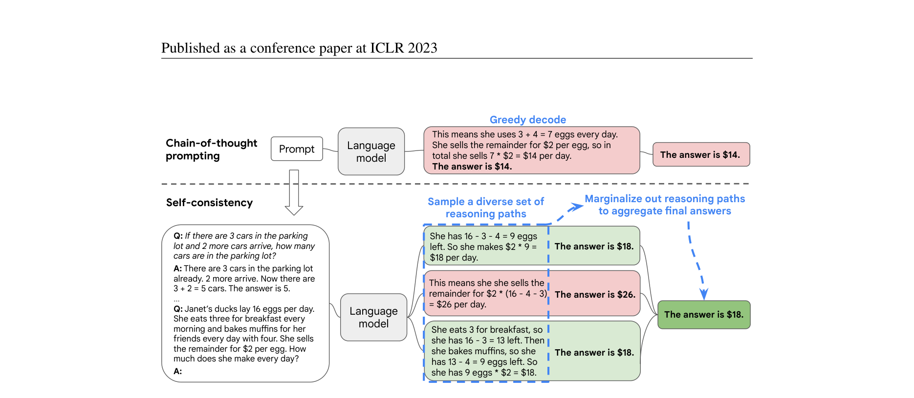
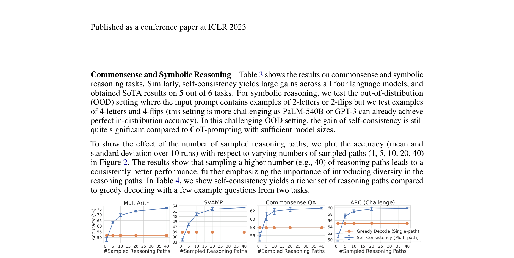
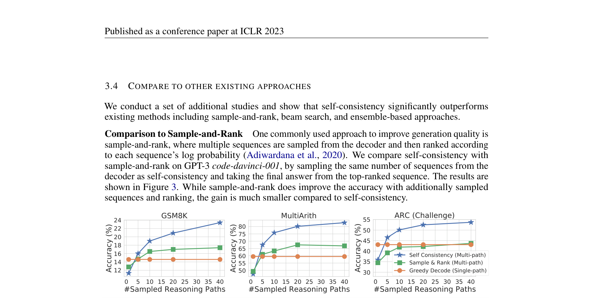
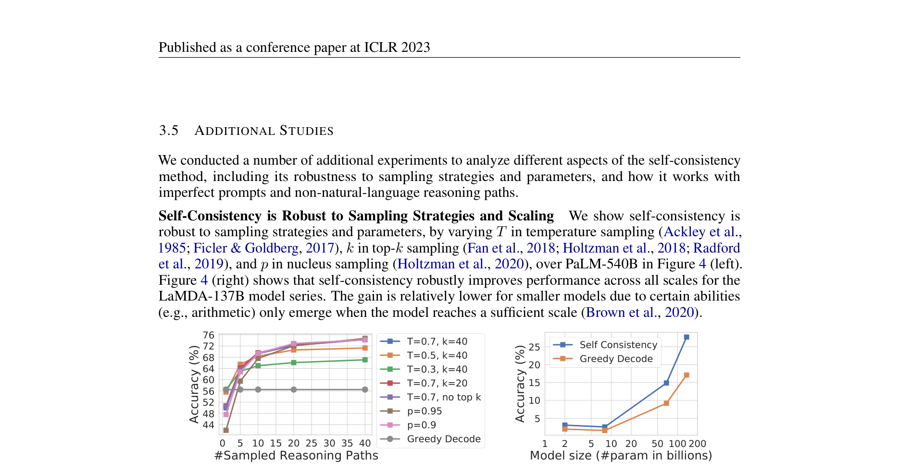
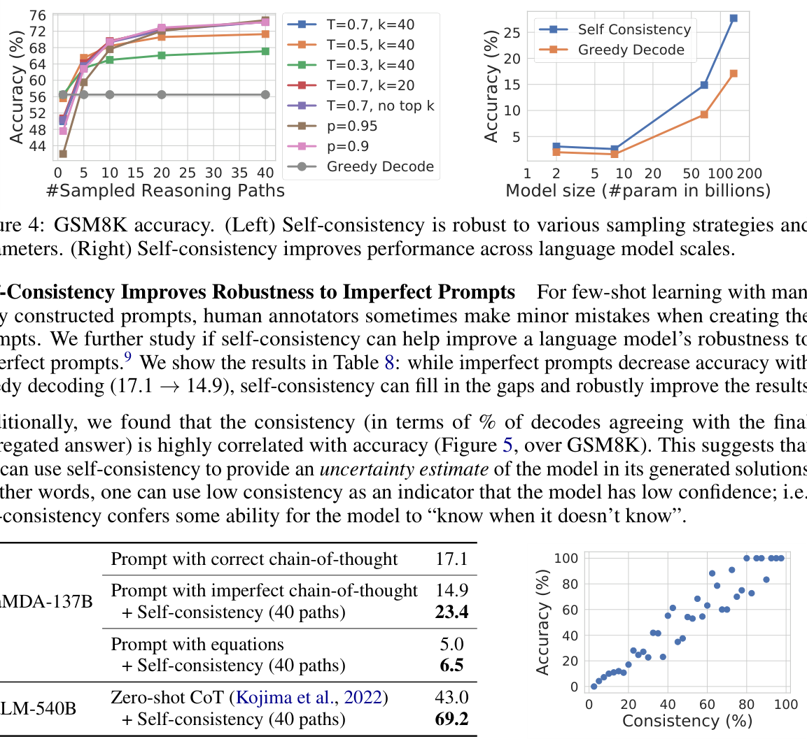
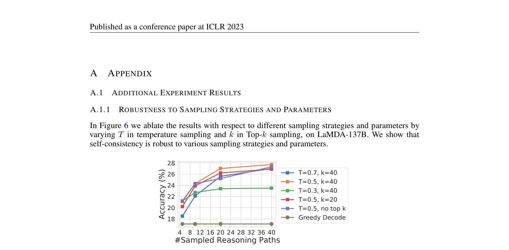
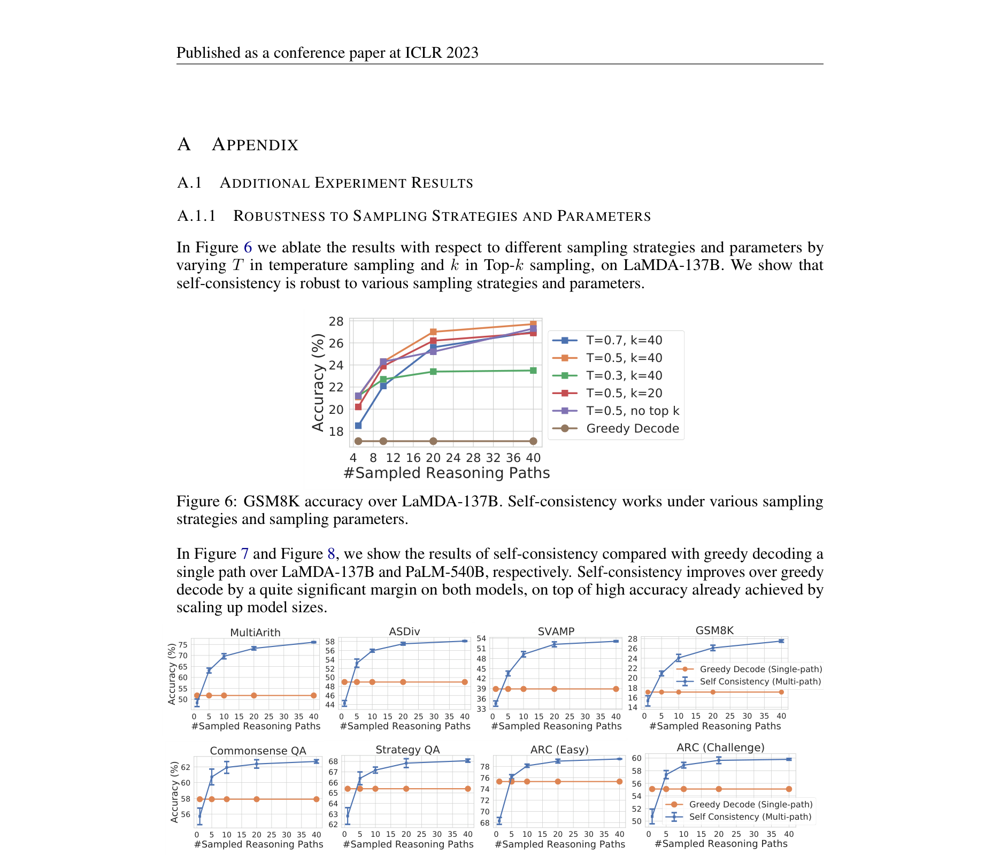
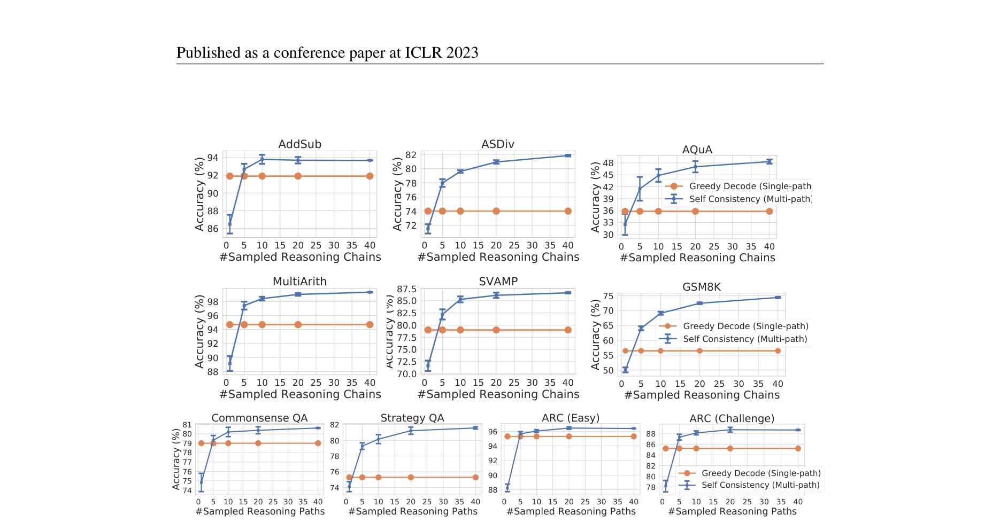

# 自一致性提升语言模型的思维链推理能力

> 原文：Published as a conference paper at ICLR 2023 · arXiv:2203.11171v4 [cs.CL] 7 Mar 2023
> 图片素材存于 `sc_assets/`
> 本文件为原 Markdown 稿的全篇中文翻译：正文、表格、图注、脚注均译为中文；图片保留原样，图下附中文讲解。参考文献按学术惯例保留原文。

**作者：** Xuezhi Wang†‡、Jason Wei†、Dale Schuurmans†、Quoc Le†、Ed H. Chi†、Sharan Narang†、Aakanksha Chowdhery†、Denny Zhou†§

† Google Research, Brain Team ｜ ‡ xuezhiw@google.com ｜ § dennyzhou@google.com

---

## 摘要

结合预训练大语言模型的思维链提示（chain-of-thought prompting）在复杂推理任务上已经取得了令人鼓舞的效果。在本文中，我们提出了一种新的解码策略——**自一致性（self-consistency）**，用以替代思维链提示中所使用的朴素贪心解码。它首先采样出一组多样化的推理路径，而不是只取贪心解码的那一条路径，然后通过对采样出的推理路径取边缘化（marginalizing out），选出最一致的答案。自一致性利用的直觉是：一个复杂推理问题通常存在多种不同的思考方式，而它们都能通向其唯一正确的答案。我们广泛的实证评估表明，自一致性在一系列流行的算术推理与常识推理基准上，以显著的优势提升了思维链提示的表现，包括 GSM8K（+17.9%）、SVAMP（+11.0%）、AQuA（+12.2%）、StrategyQA（+6.4%）和 ARC-challenge（+3.9%）。

---

## 1 引言

尽管语言模型在众多 NLP 任务上展示了非凡的成功，但它们的推理能力常被视为一种局限，且这种局限无法仅靠增大模型规模来克服（Rae et al., 2021; BIG-bench collaboration, 2021 等）。为弥补这一短板，Wei et al. (2022) 提出了**思维链提示（chain-of-thought prompting）**：让语言模型生成一系列短句，模仿人类解决任务时可能采用的推理过程。例如，对于问题"停车场里有 3 辆车，又来了 2 辆，停车场里一共有多少辆车？"，语言模型不再被提示直接回答"5"，而是被提示输出完整的思维链："停车场里已有 3 辆车。又来了 2 辆。现在一共有 3 + 2 = 5 辆车。答案是 5。"已有观察表明，思维链提示能显著提升模型在多种多步骤推理任务上的表现（Wei et al., 2022）。

在本文中，我们引入一种名为**自一致性**的新解码策略，用以替代思维链提示（Wei et al., 2022）中使用的贪心解码策略，从而大幅提升语言模型的推理性能。自一致性利用的直觉是：复杂推理任务通常存在多条能到达正确答案的推理路径（Stanovich & West, 2000）。一个问题越需要深思熟虑与分析（Evans, 2010），能还原出正确答案的推理路径就越多样。



**图 1：** 自一致性方法包含三个步骤：(1) 用思维链（CoT）提示语言模型；(2) 将 CoT 提示中的"贪心解码"替换为从语言模型的解码器中采样，从而生成一组多样化的推理路径；(3) 对推理路径取边缘化，在最终答案集合中选出最一致的答案进行聚合。

**图片讲解：** 这张图是自一致性方法的总览示意。左侧是传统的贪心解码：给定问题后模型只沿着一条"最可能"的路径往下生成，一旦中途走偏，最终答案就直接错了。右侧是自一致性的做法：同一个问题被采样出多条不同的推理路径（图中每条路径的算式和叙述方式各不相同），每条路径各自得出一个最终答案；最后把所有路径的答案汇总起来"投票"，得票最多的那个就是最终输出。图中可以看到，多数路径都指向同一个正确答案，而那条算错的孤立路径会被投票淹没——这正是"多种思路都指向同一答案时，我们对答案更有信心"这一直觉的形式化。

图 1 用一个例子展示了自一致性方法。我们先用思维链提示语言模型，然后不再贪心地解码出"最优"的那条推理路径，而是提出一个"采样再边缘化（sample-and-marginalize）"的解码流程：先从语言模型的解码器中采样，生成一组多样化的推理路径；每条推理路径可能导向不同的最终答案，于是我们对采样出的推理路径取边缘化，在最终答案集合中找出最一致的答案，以此确定最优答案。这种做法类似于人类经验：如果多种不同的思考方式都通向同一个答案，我们就更有把握相信最终答案是正确的。与其他解码方法相比，自一致性既避免了贪心解码常有的重复性与局部最优问题，又缓解了单次采样生成的随机性。

自一致性远比此前的做法简单——此前的做法要么额外训练一个验证器（Cobbe et al., 2021），要么借助额外的人工标注训练一个重排序器来提升生成质量（Thoppilan et al., 2022）。相比之下，自一致性完全**无监督**，可以直接用在预训练语言模型上，不需要任何额外人工标注，也不需要任何额外训练、辅助模型或微调。自一致性也不同于典型的集成（ensemble）方法——后者训练多个模型并聚合各模型的输出；自一致性更像是一种"自集成"，作用于**单个**语言模型之上。

我们在四个不同规模的语言模型上，对广泛的算术推理与常识推理任务评估了自一致性：公开模型 UL2-20B（Tay et al., 2022）和 GPT-3-175B（Brown et al., 2020），以及两个稠密激活的 decoder-only 语言模型：LaMDA-137B（Thoppilan et al., 2022）和 PaLM-540B（Chowdhery et al., 2022）。在全部四个语言模型上，自一致性在所有任务上都以显著优势超过思维链提示。特别地，当与 PaLM-540B 或 GPT-3 搭配时，自一致性在算术推理任务上达到了新的最先进水平，包括 GSM8K（Cobbe et al., 2021）（绝对准确率 +17.9%）、SVAMP（Patel et al., 2021）（+11.0%）、AQuA（Ling et al., 2017）（+12.2%），以及常识推理任务如 StrategyQA（Geva et al., 2021）（+6.4%）和 ARC-challenge（Clark et al., 2018）（+3.9%）。在附加实验中，我们展示了自一致性能够稳健地提升那些"加思维链反而比标准提示更差"的 NLP 任务的表现（Ye & Durrett, 2022）。我们还展示了自一致性显著优于"采样-排序（sample-and-rank）"、束搜索（beam search）与基于集成的方法，并且对采样策略和不完美的提示词具有鲁棒性。

---

## 2 基于多样化推理路径的自一致性

人类的一个显著特点是人们的思考方式各不相同。可以自然地设想：在需要深思熟虑的任务中，往往存在好几种切入问题的方式。我们提出，可以通过从语言模型的解码器中采样，在语言模型里模拟这一过程。例如，如图 1 所示，模型可以对一个数学问题生成多个貌似合理的回答，它们都得到同一个正确答案（输出 1 和输出 3）。由于语言模型并非完美的推理者，它也可能生成错误的推理路径，或在某个推理步骤中犯错（如输出 2），但这类解答不太可能到达**同一个**答案。也就是说，我们假设：正确的推理过程即使彼此多样，其最终答案的相互一致程度也倾向于高于错误过程之间的一致程度。

我们利用这一直觉，提出如下的自一致性方法。首先，用一组人工编写的思维链示例来提示语言模型（Wei et al., 2022）。接着，从语言模型的解码器中采样一组候选输出，得到一组多样化的候选推理路径。自兼容于大多数现有采样算法，包括温度采样（Ackley et al., 1985; Ficler & Goldberg, 2017）、top-k 采样（Fan et al., 2018; Holtzman et al., 2018; Radford et al., 2019）和核采样（nucleus sampling，Holtzman et al., 2020）。最后，通过对采样出的推理路径取边缘化、在生成的诸答案中选出最一致的那个，来聚合答案。

更具体地，假设生成的答案 $a_i$ 来自一个固定的答案集合，$a_i \in A$，其中 $i = 1, \dots, m$ 为从解码器采样出的 $m$ 个候选输出的编号。给定提示与问题，自一致性引入一个额外的隐变量 $r_i$，它是表示第 $i$ 个输出中推理路径的 token 序列，然后把 $(r_i, a_i)$ 的生成耦合起来，其中 $r_i \to a_i$，即：生成推理路径 $r_i$ 是可选的，它只用于导出最终答案 $a_i$。举一个例子，看图 1 中的输出 3：前面几句话"她早餐吃了 3 个……所以她还剩 9 个鸡蛋，9 × $2 = $18。"构成 $r_i$；而最后一句"答案是 $18"中的答案 18 被解析为 $a_i$。¹ 从模型解码器中采样出多组 $(r_i, a_i)$ 之后，自一致性对 $r_i$ 做边缘化——对 $a_i$ 进行**多数投票（majority vote）**：

$$
\arg\max_{a} \sum_{i=1}^{m} \mathbb{1}(a_i = a),
$$

也就是选出最终答案集合中我们定义为最"一致"的那个答案。

在表 1 中，我们展示了在一组推理任务上使用不同答案聚合策略的测试准确率。除了多数投票之外，聚合答案时也可以用 $P(r_i, a_i \mid \text{prompt}, \text{question})$ 对每个 $(r_i, a_i)$ 加权。注意，要计算 $P(r_i, a_i \mid \text{prompt}, \text{question})$，既可以直接取模型在给定（提示，问题）条件下生成 $(r_i, a_i)$ 的未归一化概率，也可以按输出长度归一化条件概率（Brown et al., 2020）：

$$
P(r_i, a_i \mid \text{prompt}, \text{question}) = \exp\!\left(\frac{1}{K} \sum_{k=1}^{K} \log P\!\left(t_k \mid \text{prompt}, \text{question}, t_1, \dots, t_{k-1}\right)\right), \tag{1}
$$

其中 $\log P(t_k \mid \text{prompt}, \text{question}, t_1, \dots, t_{k-1})$ 是在前文 token 条件下生成 $(r_i, a_i)$ 中第 $k$ 个 token $t_k$ 的对数概率，$K$ 是 $(r_i, a_i)$ 的 token 总数。

**表 1：** 在 PaLM-540B 上，不同答案聚合策略的准确率比较。

| 方法 | GSM8K | MultiArith | AQuA | SVAMP | CSQA | ARC-c |
|---|---|---|---|---|---|---|
| 贪心解码 | 56.5 | 94.7 | 35.8 | 79.0 | 79.0 | 85.2 |
| 加权平均（未归一化） | 56.3±0.0 | 90.5±0.0 | 35.8±0.0 | 73.0±0.0 | 74.8±0.0 | 82.3±0.0 |
| 加权平均（归一化） | 22.1±0.0 | 59.7±0.0 | 15.7±0.0 | 40.5±0.0 | 52.1±0.0 | 51.7±0.0 |
| 加权求和（未归一化） | 59.9±0.0 | 92.2±0.0 | 38.2±0.0 | 76.2±0.0 | 76.2±0.0 | 83.5±0.0 |
| 加权求和（归一化） | 74.1±0.0 | 99.3±0.0 | 48.0±0.0 | 86.8±0.0 | 80.7±0.0 | 88.7±0.0 |
| **不加权求和（多数投票）** | **74.4±0.1** | **99.3±0.0** | **48.3±0.5** | **86.6±0.1** | **80.7±0.1** | **88.7±0.1** |

表 1 显示：采用"不加权求和"，即直接对 $a_i$ 做多数投票，其准确率与使用"归一化加权和"聚合非常接近。我们仔细查看了模型的输出概率，发现原因在于：对每个 $(r_i, a_i)$，归一化条件概率 $P(r_i, a_i \mid \text{prompt}, \text{question})$ 彼此非常接近，也就是说语言模型把这些生成结果视为"差不多等可能"。² 另外，在聚合答案时，表 1 的结果表明"归一化"的加权和（即式 (1)）比未归一化版本准确率高得多。为完整起见，我们在表 1 中也报告了"加权平均"的结果，即每个答案 $a$ 的得分是其加权和除以 $\sum_{i=1}^{m} \mathbb{1}(a_i = a)$，这种方式的性能要差得多。

自一致性在开放式文本生成与"答案固定的最优文本生成"之间探索出一片有趣的空间。推理任务通常有固定答案，这正是研究者普遍采用贪心解码的原因（Radford et al., 2019; Wei et al., 2022; Chowdhery et al., 2022）。然而我们发现，即便期望的答案是固定的，在推理过程中引入多样性也能带来巨大收益；因此我们借助开放式文本生成中常用的采样（Radford et al., 2019; Brown et al., 2020; Thoppilan et al., 2022）来实现这一目标。需要注意的是，自一致性只能应用于最终答案来自固定答案集合的问题；但原则上，只要能定义出多个生成结果之间的一致性度量（例如两个答案是相互印证还是相互矛盾），这种方法就可以扩展到开放式文本生成问题。

> ¹ 解析器（parser）因任务而异。对算术推理，我们在模型生成"The answer is"之后，把第一个数值部分解析为最终答案。对常识推理，我们在模型生成"The answer is"之后，把完整的字符串答案解析为最终答案。只要按这种格式提示语言模型，大多数生成输出都会遵循"{推理路径}。The answer is X。"的一致格式。
>
> ² 这也意味着语言模型的校准性（calibration）并不好，无法很好地区分正确解法与错误解法；这同时解释了为何此前的工作要额外训练重排序器来更好地判断解法质量（Cobbe et al., 2021; Thoppilan et al., 2022）。

---

## 3 实验

我们做了一系列实验，在多个推理基准上把所提出的自一致性方法与已有方法进行比较。我们发现：在我们考察的每一个语言模型上，无论模型规模如何，自一致性都稳健地提升了推理准确率。

### 3.1 实验设置

**任务与数据集。** 我们在以下推理基准上评估自一致性。³

- **算术推理。** 对这些任务，我们使用数学应用题库（Math Word Problem Repository，Koncel-Kedziorski et al., 2016），包括 AddSub（Hosseini et al., 2014）、MultiArith（Roy & Roth, 2015）和 ASDiv（Miao et al., 2020）。我们还加入了 AQUA-RAT（Ling et al., 2017）、新近发布的小学数学应用题基准 GSM8K（Cobbe et al., 2021），以及数学应用题的挑战数据集 SVAMP（Patel et al., 2021）。
- **常识推理。** 对这些任务，我们使用 CommonsenseQA（Talmor et al., 2019）、StrategyQA（Geva et al., 2021）和 AI2 推理挑战（ARC，Clark et al., 2018）。
- **符号推理。** 我们评估两个符号推理任务：字母尾拼接（last letter concatenation，例如输入是"Elon Musk"，输出应为"nk"），以及取自 Wei et al. (2022) 的 Coinflip（例如：一枚硬币正面朝上，翻转若干次后它是否仍然正面朝上？）。

**语言模型与提示词。** 我们在四个不同规模的基于 Transformer 的语言模型上评估自一致性：

- **UL2**（Tay et al., 2022）是一个 200 亿参数的 encoder-decoder 模型，用混合去噪目标训练。UL2 完全开源⁴，仅凭 20B 参数就在 zero-shot SuperGLUE 上取得与 GPT-3 相近甚至更好的性能，因此计算上更友好；
- **GPT-3**（Brown et al., 2020），1750 亿参数。为便于复现，我们使用 Codex 系列（Chen et al., 2021）中两个公开引擎 `code-davinci-001` 和 `code-davinci-002`；⁵
- **LaMDA-137B**（Thoppilan et al., 2022）是一个 1370 亿参数的稠密、从左到右、decoder-only 语言模型，在网页文档、对话数据与维基百科的混合语料上预训练；
- **PaLM-540B**（Chowdhery et al., 2022）是一个 5400 亿参数的稠密、从左到右、decoder-only 语言模型，在 7800 亿 token 的高质量语料上预训练，语料包含经过筛选的网页、书籍、维基百科、新闻、源代码与社交媒体对话。

所有实验都在少样本（few-shot）设定下进行，不训练或微调语言模型。为公平比较，我们使用与 Wei et al. (2022) 相同的提示词：对所有算术推理任务使用同一组 8 条人工编写的示例；对每个常识推理任务，从训练集中随机选取 4–7 条示例并人工配上思维链。⁶ 所用提示词的完整细节见附录 A.3。

**采样方案。** 为了采样出多样的推理路径，我们沿用 Radford et al. (2019); Holtzman et al. (2020) 针对开放式文本生成建议的类似设置。具体地：对 UL2-20B 和 LaMDA-137B，我们使用温度采样 T = 0.5 并截断概率最高的 top-k（k = 40）个 token；对 PaLM-540B 使用 T = 0.7、k = 40；对 GPT-3 使用 T = 0.7 且不做 top-k 截断。我们在 3.5 节给出消融研究，表明自一致性对采样策略与参数总体上是鲁棒的。

> ³ 默认情况下，只要测试集标签可用于评估，我们对所有数据集使用测试集。对 CommonsenseQA 我们使用 dev 集；对 StrategyQA 我们使用 BIG-bench collaboration (2021) 的仅问题集合：https://github.com/google/BIG-bench/tree/main/bigbench/benchmark_tasks/strategyqa。
> ⁴ 模型检查点见 https://github.com/google-research/google-research/tree/master/ul2。
> ⁵ 公开 API 见 https://openai.com/api/。
> ⁶ 自一致性对不同的提示词集合是鲁棒的，我们在附录 A.1.2 中给出研究。

### 3.2 主要结果

我们报告的自一致性结果是 10 次运行的平均值，每次运行从解码器中独立采样 40 个输出。我们对比的基线是采用贪心解码的思维链提示（Wei et al., 2022），记为 **CoT-prompting**——这也是大语言模型解码中此前一直使用的做法（Chowdhery et al., 2022）。

**算术推理。** 结果见表 2。⁷ 在**全部四个语言模型**上，自一致性相比思维链提示都显著提升了算术推理性能。更令人惊讶的是，模型规模越大收益越显著：例如在 UL2-20B 上我们看到 +3%–6% 的绝对准确率提升，而在 LaMDA-137B 和 GPT-3 上则是 +9%–23%。对已经在多数任务上取得高准确率的大模型（如 GPT-3 和 PaLM-540B），自一致性仍带来可观的额外收益：在 AQuA 和 GSM8K 这类任务上绝对准确率提升 +12%–18%，在 SVAMP 和 ASDiv 上提升 +7%–11%。借助自一致性，我们在几乎所有任务上取得了新的最先进结果。

**表 2：** 自一致性与思维链提示（Wei et al., 2022）的算术推理准确率比较。每行最优者加粗。

| 方法 | AddSub | MultiArith | ASDiv | AQuA | SVAMP | GSM8K |
|---|---|---|---|---|---|---|
| 此前 SoTA | 94.9ᵃ | 60.5ᵃ | 75.3ᵇ | 37.9ᶜ | 57.4ᵈ | 35ᵉ / 55ᵍ |
| **UL2-20B** | | | | | | |
| CoT-prompting | 18.2 | 10.7 | 16.9 | 23.6 | 12.6 | 4.1 |
| 自一致性 | 24.8(+6.6) | 15.0(+4.3) | 21.5(+4.6) | 26.9(+3.3) | 19.4(+6.8) | 7.3(+3.2) |
| **LaMDA-137B** | | | | | | |
| CoT-prompting | 52.9 | 51.8 | 49.0 | 17.7 | 38.9 | 17.1 |
| 自一致性 | 63.5(+10.6) | 75.7(+23.9) | 58.2(+9.2) | 26.8(+9.1) | 53.3(+14.4) | 27.7(+10.6) |
| **PaLM-540B** | | | | | | |
| CoT-prompting | 91.9 | 94.7 | 74.0 | 35.8 | 79.0 | 56.5 |
| 自一致性 | 93.7(+1.8) | 99.3(+4.6) | 81.9(+7.9) | 48.3(+12.5) | 86.6(+7.6) | **74.4(+17.9)** |
| **GPT-3 / code-davinci-001** | | | | | | |
| CoT-prompting | 57.2 | 59.5 | 52.7 | 18.9 | 39.8 | 14.6 |
| 自一致性 | 67.8(+10.6) | 82.7(+23.2) | 61.9(+9.2) | 25.6(+6.7) | 54.5(+14.7) | 23.4(+8.8) |
| **GPT-3 / code-davinci-002** | | | | | | |
| CoT-prompting | 89.4 | 96.2 | 80.1 | 39.8 | 75.8 | 60.1 |
| 自一致性 | 91.6(+2.2) | **100.0(+3.8)** | **87.8(+7.6)** | **52.0(+12.2)** | **86.8(+11.0)** | **78.0(+17.9)** |

> SoTA 基线说明：ᵃ 相关性 + LCA 操作分类器（Roy & Roth, 2015）；ᵇ Lan et al. (2021)；ᶜ Amini et al. (2019)；ᵈ Pi et al. (2022)；ᵉ 用 7.5k 样本微调的 GPT-3 175B（Cobbe et al., 2021）；ᵍ 微调的 GPT-3 175B 再加一个额外的 175B 验证器（Cobbe et al., 2021）。

**常识与符号推理。** 表 3 展示了常识与符号推理任务的结果。同样地，自一致性在全部四个语言模型上都带来大幅收益，并在 6 个任务中的 5 个上取得了 SoTA 结果。对符号推理，我们测试了分布外（OOD）设定：输入提示中包含 2 个字母或 2 次翻转的示例，但我们测试的是 4 个字母和 4 次翻转的样例（该设定更具挑战性，因为 PaLM-540B 或 GPT-3 在分布内已能达到满分）。即便在这个有挑战性的 OOD 设定下，只要模型规模足够，自一致性相比 CoT-prompting 的收益依然相当显著。

**表 3：** 自一致性与思维链提示在常识与符号推理上的准确率比较。每行最优者加粗。

| 方法 | CSQA | StrategyQA | ARC-e | ARC-c | 字母拼接(4) | Coinflip(4) |
|---|---|---|---|---|---|---|
| 此前 SoTA | 91.2ᵃ | 73.9ᵇ | 86.4ᶜ | 75.0ᶜ | 不适用 | 不适用 |
| **UL2-20B** | | | | | | |
| CoT-prompting | 51.4 | 53.3 | 61.6 | 42.9 | 0.0 | 50.4 |
| 自一致性 | 55.7(+4.3) | 54.9(+1.6) | 69.8(+8.2) | 49.5(+6.8) | 0.0(+0.0) | 50.5(+0.1) |
| **LaMDA-137B** | | | | | | |
| CoT-prompting | 57.9 | 65.4 | 75.3 | 55.1 | 8.2 | 72.4 |
| 自一致性 | 63.1(+5.2) | 67.8(+2.4) | 79.3(+4.0) | 59.8(+4.7) | 8.2(+0.0) | 73.5(+1.1) |
| **PaLM-540B** | | | | | | |
| CoT-prompting | 79.0 | 75.3 | 95.3 | 85.2 | 65.8 | 88.2 |
| 自一致性 | 80.7(+1.7) | **81.6(+6.3)** | **96.4(+1.1)** | **88.7(+3.5)** | 70.8(+5.0) | 91.2(+3.0) |
| **GPT-3 / code-davinci-001** | | | | | | |
| CoT-prompting | 46.6 | 56.7 | 63.1 | 43.1 | 7.8 | 71.4 |
| 自一致性 | 54.9(+8.3) | 61.7(+5.0) | 72.1(+9.0) | 53.7(+10.6) | 10.0(+2.2) | 75.9(+4.5) |
| **GPT-3 / code-davinci-002** | | | | | | |
| CoT-prompting | 79.0 | 73.4 | 94.0 | 83.6 | 70.4 | **99.0** |
| 自一致性 | **81.5(+2.5)** | 79.8(+6.4) | 96.0(+2.0) | 87.5(+3.9) | **73.4(+3.0)** | **99.5(+0.5)** |

> SoTA 基线说明：ᵃ DeBERTaV3-large + KEAR（Xu et al., 2021b）；ᵇ Chowdhery et al. (2022)；ᶜ UnifiedQA-FT（Khashabi et al., 2020）。



**图 2：** 在 LaMDA-137B 上，自一致性（蓝色）在算术与常识推理任务上显著提升了准确率，超过采用贪心解码的 CoT-prompting（橙色）。采样更多样的推理路径会持续提升推理准确率。

**图片讲解：** 图中每个子任务有两组柱状/曲线对比：橙色是贪心解码的思维链基线（相当于采样 1 条路径，没有投票可言），蓝色是自一致性。横轴是采样的推理路径数量（1、5、10、20、40），纵轴是准确率。可以清楚看到两条规律：一是蓝色始终高于橙色，说明"多采几条路再投票"本身就比"只走一条路"强；二是蓝色随采样数增加单调上升、且收益递减趋于平缓——采 40 条比采 5 条更好，但从 20 到 40 的提升幅度已经很小。这为实践提供了直接指导：预算有限时采 5–10 条就能拿到大头收益。

为展示采样推理路径数量的影响，我们在图 2 中绘制了准确率（10 次运行的均值与标准差）随采样路径数（1、5、10、20、40）变化的曲线。结果表明，采样更多（如 40 条）推理路径会带来持续更好的性能，进一步强调了在推理路径中引入多样性的重要性。在表 4 中，我们用两个任务中的几个示例问题展示了：相比贪心解码，自一致性能生成更丰富的推理路径集合。

**表 4：** 在 PaLM-540B 上，自一致性帮助修复贪心解码错误的示例。

| 任务 | 问题 | 贪心解码 | 采样路径 1 | 采样路径 2 |
|---|---|---|---|---|
| GSM8K | Henry 在一次 60 英里的骑行之旅中停了两次。他第一次在骑了 20 英里后停下。第二次停靠点距旅程终点还有 15 英里。他在第一次与第二次停靠点之间骑行了多少英里？ | 他总共骑行了 60 英里。他在 20 英里处停下，所以他在第一与第二停靠点之间骑行了 60 - 20 = 40 英里。答案是 40。 | Henry 总共骑行了 60 英里。第一次停靠点在 20 英里处，第二次停靠点距终点 15 英里。所以第一与第二停靠点之间他骑行了 60 - 20 - 15 = 25 英里。答案是 25。 | 他在一次 60 英里的旅途中停了两次。第一次在行程第 20 英里处。第二次在距终点 15 英里处。这意味着第二次停靠点位于行程第 60 - 15 = 45 英里处。由于两次停靠是依序发生的，第二次停靠点必定在第一次之后 45 - 20 = 25 英里处。答案是 25。 |
| StrategyQA | 回答是或否：佐治亚州的奥尔巴尼（Albany, Georgia）是美国人口最多的"奥尔巴尼"吗？ | 佐治亚州的奥尔巴尼是美国人口最多的奥尔巴尼。因此，答案是"是"。 | 美国人口最多的奥尔巴尼是纽约州的奥尔巴尼。因此，佐治亚州的奥尔巴尼不是美国人口最多的奥尔巴尼。所以答案是"否"。 | 佐治亚州的奥尔巴尼人口约 88,000。纽约州的奥尔巴尼人口约 95,000。因此，佐治亚州的奥尔巴尼不是美国人口最多的奥尔巴尼。所以答案是"否"。 |

### 3.3 当思维链损害性能时，自一致性仍有帮助

Ye & Durrett (2022) 指出，在少样本上下文学习中，思维链提示有时反而比标准提示更差。我们在此做一项研究，看自一致性能否在一系列常见 NLP 任务上弥补这一差距，包括 (1) 闭卷问答：BoolQ（Clark et al., 2019）、HotpotQA（Yang et al., 2018）；(2) 自然语言推理：e-SNLI（Camburu et al., 2018）、ANLI（Nie et al., 2020）和 RTE（Dagan et al., 2005; Bar-Haim et al., 2006; Giampiccolo et al., 2007; Bentivogli et al., 2009）。

**表 5：** 在常见 NLP 任务上比较标准提示/CoT 提示与自一致性（PaLM-540B）。

| 方法 | ANLI R1 / R2 / R3 | e-SNLI | RTE | BoolQ | HotpotQA (EM/F1) |
|---|---|---|---|---|---|
| 标准提示（无理由链） | 69.1 / 55.8 / 55.8 | 85.8 | 84.8 | 71.3 | 27.1 / 36.8 |
| CoT-prompting（Wei et al., 2022） | 68.8 / 58.9 / 60.6 | 81.0 | 79.1 | 74.2 | 28.9 / 39.8 |
| **自一致性** | **78.5 / 64.5 / 63.4** | **88.4** | **86.3** | **78.4** | **33.8 / 44.6** |

对某些任务（如 ANLI-R1、e-SNLI、RTE），加入思维链确实比标准提示（Brown et al., 2020）更差，但自一致性能稳健地提升性能并超过标准提示，使它成为在常见 NLP 任务的少样本上下文学习中可靠地引入理由链（rationale）的方式。

### 3.4 与其他已有方法的比较

我们做了一组额外研究，表明自一致性显著优于已有方法，包括"采样-排序"（sample-and-rank）、束搜索与基于集成的方法。

**与"采样-排序"比较。** 提升生成质量的一种常用方法是"采样-排序"：从解码器中采样多条序列，然后按每条序列的对数概率排序（Adiwardana et al., 2020）。我们在 GPT-3 `code-davinci-001` 上把自一致性与"采样-排序"比较：两者从解码器采样相同数量的序列，"采样-排序"取排名第一序列的最终答案。



**图 3：** 在相同采样数量下，自一致性显著优于"采样-排序"。

**图片讲解：** 图中横轴是采样的序列条数，纵轴是准确率，两条曲线分别对应自一致性与"采样-排序"。两者都随采样数增加而上升，但自一致性的曲线明显更陡、更高。其含义是：按模型概率挑"最自信的那条"（采样-排序）收益有限——因为模型自信不等于答案正确（见正文脚注²关于校准性的讨论）；而按答案投票（自一致性）则把多样性转化为纠错能力，同样的计算预算下效果好得多。

"采样-排序"确实会随着额外采样与排序提升准确率，但收益远小于自一致性。

**与束搜索比较。** 在表 6 中，我们在 UL2-20B 模型上把自一致性与束搜索解码作比较。为公平起见，我们在相同束数与推理路径数下报告准确率。在两个任务上，自一致性都显著优于束搜索。注意，自一致性也可以采用束搜索来解码每条推理路径，但其性能不如"自一致性 + 采样"。原因是束搜索的输出多样性更低（Li & Jurafsky, 2016），而在自一致性中，推理路径的多样性恰恰是更好性能的关键。

**表 6：** 在 UL2-20B 模型上比较自一致性与束搜索解码。

| 束宽 / 自一致性路径数 | 1 | 5 | 10 | 20 | 40 |
|---|---|---|---|---|---|
| **AQuA** | | | | | |
| 束搜索解码（取最优束） | 23.6 | 19.3 | 16.1 | 15.0 | 10.2 |
| 自一致性（用束搜索） | 23.6 | 19.8±0.3 | 21.2±0.7 | 24.6±0.4 | 24.2±0.5 |
| **自一致性（用采样）** | 19.7±2.5 | 24.9±2.6 | 25.3±1.8 | 26.7±1.0 | **26.9±0.5** |
| **MultiArith** | | | | | |
| 束搜索解码（取最优束） | 10.7 | 12.0 | 11.3 | 11.0 | 10.5 |
| 自一致性（用束搜索） | 10.7 | 11.8±0.0 | 11.4±0.1 | 12.3±0.1 | 10.8±0.1 |
| **自一致性（用采样）** | 9.5±1.2 | 11.3±1.2 | 12.3±0.8 | 13.7±0.9 | **14.7±0.3** |

**与基于集成的方法比较。** 我们进一步把自一致性与少样本学习的集成方法作比较。具体地，我们考虑两种集成方式：(1) 提示顺序置换：把提示中的示例随机置换 40 次，以缓解模型对提示顺序的敏感性（Zhao et al., 2021; Lu et al., 2021）；(2) 多套提示（Gao et al., 2021）：人工编写 3 套不同的提示。两种方式我们都对贪心解码的答案做多数投票作为集成。表 7 显示：与自一致性相比，已有集成方法的收益要小得多。⁸

**表 7：** 在 LaMDA-137B 上，自一致性优于"提示顺序集成"与"多套提示集成"。

| 方法 | GSM8K | MultiArith | SVAMP | ARC-e | ARC-c |
|---|---|---|---|---|---|
| CoT（Wei et al., 2022） | 17.1 | 51.8 | 38.9 | 75.3 | 55.1 |
| 集成（3 套提示） | 18.6±0.5 | 57.1±0.7 | 42.1±0.6 | 76.6±0.1 | 57.0±0.2 |
| 集成（40 次提示顺序置换） | 19.2±0.1 | 60.9±0.2 | 42.7±0.1 | 76.9±0.1 | 57.0±0.1 |
| **自一致性（40 条采样路径）** | **27.7±0.2** | **75.7±0.3** | **53.3±0.2** | **79.3±0.3** | **59.8±0.2** |

> ⁸ 自兼容于这两种集成方法，结果见附录 A.1.4。

另外请注意，自一致性不同于典型的模型集成方法——后者训练多个模型并聚合它们的输出。自一致性更像是作用于**单个**语言模型之上的"自集成"。我们在附录 A.1.3 额外给出了多模型集成的结果，其表现远不如自一致性。

### 3.5 补充研究

我们做了大量补充实验，分析自一致性方法的各个方面，包括它对采样策略与参数的鲁棒性，以及它在不完美提示与非自然语言推理路径下的表现。

**自一致性对采样策略与规模扩展均鲁棒。** 我们在 PaLM-540B 上分别改变温度采样的 T（Ackley et al., 1985; Ficler & Goldberg, 2017）、top-k 采样的 k（Fan et al., 2018; Holtzman et al., 2018; Radford et al., 2019）与核采样的 p（Holtzman et al., 2020），在图 4（左）中表明自一致性对采样策略与参数是鲁棒的。图 4（右）表明：在 LaMDA-137B 模型系列的所有规模上，自一致性都稳健地提升性能。较小模型的收益相对有限，因为某些能力（如算术）只有在模型达到足够规模时才会涌现（Brown et al., 2020）。



**图 4：** GSM8K 准确率。（左）自一致性对各种采样策略与参数均鲁棒。（右）自一致性在各语言模型规模上均提升性能。

**图片讲解：** 左图把温度 T、top-k 的 k、核采样的 p 各自的取值扫了一遍：无论怎么调采样参数，自一致性（相对贪心基线的）增益都稳定为正，说明方法不依赖某组"魔法超参数"。右图把 LaMDA 模型系列从小到大排列：每个规模点上自一致性都在贪心基线之上，但小模型的增益小、大模型的增益大——这与"推理能力随规模涌现"的现象一致：模型得先"会做"，多样性投票才有正确的候选可投。

**自一致性提升对不完美提示的鲁棒性。** 在用人工构造提示做少样本学习时，标注者有时会在提示里犯小错误。我们进一步研究自一致性能否提升语言模型对不完美提示的鲁棒性。⁹ 结果见表 8：不完美提示会降低贪心解码的准确率（17.1 → 14.9），而自一致性能弥补差距并稳健地提升结果。

**表 8：** 在 GSM8K 上，自一致性在不完美提示、方程式提示与零样本思维链下均有效。

| 模型 / 提示 | 准确率 |
|---|---|
| **LaMDA-137B** | |
| 正确思维链的提示 | 17.1 |
| 不完美思维链的提示 | 14.9 |
| + 自一致性（40 条路径） | 23.4 |
| 方程式提示 | 5.0 |
| + 自一致性（40 条路径） | 6.5 |
| **PaLM-540B** | |
| 零样本 CoT（Kojima et al., 2022） | 43.0 |
| + 自一致性（40 条路径） | 69.2 |

此外我们发现，一致性（即同意最终聚合答案的解码比例）与准确率高度相关（图 5，GSM8K 上）。这意味着可以用自一致性为模型生成的解法提供**不确定性估计**。换句话说，可以把低一致性作为模型低置信度的指示器；也就是说，自一致性赋予了模型某种"知道自己不知道"的能力。



**图 5：** 一致性与模型准确率相关。

**图片讲解：** 图中横轴是一致性程度——40 条采样路径中有多少比例投给了最终胜出的答案，纵轴是对应的实际准确率。两者呈明显正相关：当几乎所有路径都指向同一答案时，答案大概率正确；当票数四分五裂时，模型基本在猜。这给出了一个免费的"置信度信号"：不用任何额外训练，仅凭投票的分散程度就能判断这次回答可不可信，可用于拒答、转人工或追加更多采样。

**自一致性适用于非自然语言推理路径与零样本 CoT。** 我们还测试了自一致性概念对中间推理的替代形式（如方程式，例如从"停车场里已有 3 辆车。又来了 2 辆。现在一共有 3 + 2 = 5 辆车。"简化为"3 + 2 = 5"）的普适性。结果见表 8（"方程式提示"一行）：生成中间方程式时自一致性依然提升准确率；不过相比生成自然语言推理路径，收益更小，因为方程式短得多，解码过程中可生成的多样性空间也小得多。此外，我们测试了自一致性与零样本思维链（Kojima et al., 2022）的结合，表 8 显示自一致性同样适用于零样本 CoT，并显著提升结果（+26.2%）。

> ⁹ 我们使用与之前相同的提示，但把推理路径中除最终答案外的所有数字替换为随机数字。例如把"停车场里已有 3 辆车。又来了 2 辆。现在一共有 3 + 2 = 5 辆车。"改成"停车场里已有 7 辆车。又来了 6 辆。现在一共有 7 + 6 = 5 辆车。"

---

## 4 相关工作

**语言模型中的推理。** 众所周知，语言模型在二型（Type 2）任务上表现挣扎，例如算术推理、逻辑推理与常识推理（Evans, 2010）。此前的工作主要聚焦于提升推理能力的专门化方法（Andor et al., 2019; Ran et al., 2019; Geva et al., 2020; Piekos et al., 2021）。与以往工作相比，自一致性无需任何额外监督或微调即可应用于广泛的推理任务，同时仍大幅提升 Wei et al. (2022) 提出的思维链提示方法的性能。

**语言模型中的采样与重排序。** 文献中已提出多种语言模型解码策略，例如温度采样（Ackley et al., 1985; Ficler & Goldberg, 2017）、top-k 采样（Fan et al., 2018; Holtzman et al., 2018; Radford et al., 2019）、核采样（Holtzman et al., 2020）、最小贝叶斯风险解码（Eikema & Aziz, 2020; Shi et al., 2022）和典型解码（typical decoding，Meister et al., 2022）。另有一些工作试图在解码过程中显式促进多样性（Batra et al., 2012; Li et al., 2016; Vijayakumar et al., 2018）。重排序是提升语言模型生成质量的另一种常见手段（Adiwardana et al., 2020; Shen et al., 2021）。Thoppilan et al. (2022) 收集额外人工标注来训练一个重排序器以过滤回复。Cobbe et al. (2021) 训练一个"验证器"对生成的解法重排序，相比仅微调语言模型大幅提升了数学任务的解题率。Elazar et al. (2021) 通过带一致性损失的扩展预训练提升事实知识抽取的一致性。这些方法要么需要训练额外的重排序器，要么需要收集额外人工标注；而自一致性不需要任何额外训练、微调或数据收集。

**抽取推理路径。** 一些先前工作考虑了识别推理路径的任务特定方法，例如构造语义图（Xu et al., 2021a）、学习一个 RNN 在维基百科图上检索推理路径（Asai et al., 2020）、用人工标注的数学推理路径做微调（Cobbe et al., 2021），或用基于启发式的伪推理路径训练一个抽取器（Chen et al., 2019）。更近一些，推理过程多样性的重要性开始被注意到，但只能通过任务特定训练来利用——要么在抽取的推理路径之上再加一个 QA 模型（Chen et al., 2019），要么在常识知识图中引入隐变量（Yu et al., 2022）。与这些方法相比，自一致性简单得多且无需额外训练：我们提出的方法只是把推理路径与最终答案的生成通过解码器采样耦合起来，用聚合还原出最一致的答案，不需要任何额外模块。

**语言模型中的一致性。** 一些先前工作表明，语言模型在对话（Adiwardana et al., 2020）、解释生成（Camburu et al., 2020）与事实知识抽取（Elazar et al., 2021）中可能受不一致性困扰。Welleck et al. (2020) 用"一致性"指递归语言模型生成无限长序列的性质。Nye et al. (2021) 通过加入受系统 2 启发的逻辑推理模块来提升系统 1 模型样本的逻辑一致性。本文聚焦一个略有不同的"一致性"概念，即利用多样推理路径之间的答案一致性来提升准确率。

## 5 结论与讨论

我们引入了一种简单而有效的方法——自一致性，并观察到它在四个不同规模的大语言模型上显著提升了大量算术与常识推理任务的准确率。除了准确率收益之外，自一致性还有两个用处：在用语言模型执行推理任务时收集理由链，以及为语言模型输出提供不确定性估计并改善其校准。

自一致性的一个局限是计算开销更大。实践中可以先尝试较少的路径数（如 5 条或 10 条）作为起点——大多数情形下性能很快饱和（图 2）——这样在不过多增加开销的情况下就能拿到大部分收益。作为未来工作的一部分，可以用自一致性生成更好的监督数据来微调模型，使微调后的模型在单次推理时就能给出更准确的预测。此外我们观察到，语言模型有时会生成不正确或无意义的推理路径（例如表 4 中 StrategyQA 的例子里两个人口数字并不完全准确），未来还需要进一步工作来更好地为模型的理由生成落地（ground）。

### 可复现性声明

实验中我们纳入了四个不同规模的语言模型，其中两个是公开模型：UL2 是完全开源的模型，检查点见 https://github.com/google-research/google-research/tree/master/ul2；GPT-3 也是公开模型，公开 API 见 https://openai.com/api/。对 GPT-3，我们纳入了两个公开引擎（"code-davinci-001" 与 "code-davinci-002"）以进一步帮助复现——由于 Codex 目前免费，任何人都可以复现结果。另外，由于我们的结果使用了不公开的 LaMDA-137B 与 PaLM-540B，我们在附录 A.3 中提供了所有任务的完整输入提示（并说明我们不做任何微调，仅对现成的语言模型施加提示）。

### 伦理声明

如讨论部分所述，语言模型有时会生成无意义或不符合事实的推理路径，因此使用时应格外谨慎地对待语言模型的输出。我们处理的绝大部分是推理任务，生成的理由链仅用于考察模型如何得到答案。人们可以利用生成的理由链进一步检查模型为何犯某些错误，或在执行某任务时是否含有偏见。对现实部署的语言模型，还需要进一步工作来更好地为模型预测落地、提升模型的事实性与安全性，确保模型不对用户造成伤害。

## 参考文献

（参考文献保留英文原文，便于检索与引用。）

- David H. Ackley, Geoffrey E. Hinton, and Terrence J. Sejnowski. A learning algorithm for boltzmann machines. *Cognitive Science*, 9(1):147–169, 1985.
- Daniel Adiwardana, Minh-Thang Luong, David R. So, Jamie Hall, Noah Fiedel, Romal Thoppilan, Zi Yang, Apoorv Kulshreshtha, Gaurav Nemade, Yifeng Lu, and Quoc V. Le. Towards a human-like open-domain chatbot, 2020.
- Aida Amini, Saadia Gabriel, Shanchuan Lin, Rik Koncel-Kedziorski, Yejin Choi, and Hannaneh Hajishirzi. MathQA: Towards interpretable math word problem solving with operation-based formalisms. In *NAACL*, 2019.
- Daniel Andor, Luheng He, Kenton Lee, and Emily Pitler. Giving BERT a calculator: Finding operations and arguments with reading comprehension. In *EMNLP-IJCNLP*, 2019.
- Akari Asai, Kazuma Hashimoto, Hannaneh Hajishirzi, Richard Socher, and Caiming Xiong. Learning to retrieve reasoning paths over wikipedia graph for question answering. In *ICLR*, 2020.
- Roy Bar-Haim, Ido Dagan, Bill Dolan, Lisa Ferro, Danilo Giampiccolo, Bernardo Magnini, and Idan Szpektor. The second pascal recognising textual entailment challenge. In *PASCAL challenges workshop*, 2006.
- Dhruv Batra, Payman Yadollahpour, Abner Guzman-Rivera, and Gregory Shakhnarovich. Diverse m-best solutions in markov random fields. In *ECCV*, 2012.
- Luisa Bentivogli, Peter Clark, Ido Dagan, and Danilo Giampiccolo. The fifth pascal recognizing textual entailment challenge. In *TAC*, 2009.
- BIG-bench collaboration. Beyond the imitation game: Measuring and extrapolating the capabilities of language models. 2021. https://github.com/google/BIG-bench/.
- Tom Brown, Benjamin Mann, Nick Ryder, et al. Language models are few-shot learners. In *NeurIPS*, 2020.
- Oana-Maria Camburu, Tim Rocktäschel, Thomas Lukasiewicz, and Phil Blunsom. e-snli: Natural language inference with natural language explanations. In *NeurIPS*, 2018.
- Oana-Maria Camburu, Brendan Shillingford, Pasquale Minervini, Thomas Lukasiewicz, and Phil Blunsom. Make up your mind! adversarial generation of inconsistent natural language explanations. In *ACL*, 2020.
- Jifan Chen, Shih-Ting Lin, and Greg Durrett. Multi-hop question answering via reasoning chains. *CoRR*, abs/1910.02610, 2019.
- Mark Chen, Jerry Tworek, Heewoo Jun, et al. Evaluating large language models trained on code. *arXiv:2107.03374*, 2021.
- Aakanksha Chowdhery, Sharan Narang, Jacob Devlin, et al. PaLM: Scaling language modeling with pathways, 2022.
- Christopher Clark, Kenton Lee, Ming-Wei Chang, Tom Kwiatkowski, Michael Collins, and Kristina Toutanova. Boolq: Exploring the surprising difficulty of natural yes/no questions. In *NAACL*, 2019.
- Peter Clark, Isaac Cowhey, Oren Etzioni, Tushar Khot, Ashish Sabharwal, Carissa Schoenick, and Oyvind Tafjord. Think you have solved question answering? try arc, the ai2 reasoning challenge. *ArXiv*, abs/1803.05457, 2018.
- Karl Cobbe, Vineet Kosaraju, Mohammad Bavarian, et al. Training verifiers to solve math word problems, 2021.
- Ido Dagan, Oren Glickman, and Bernardo Magnini. The pascal recognising textual entailment challenge. In *Machine Learning Challenges Workshop*, 2005.
- Bryan Eikema and Wilker Aziz. Is MAP decoding all you need? the inadequacy of the mode in neural machine translation. In *COLING*, 2020.
- Yanai Elazar, Nora Kassner, Shauli Ravfogel, Abhilasha Ravichander, Eduard Hovy, Hinrich Schütze, and Yoav Goldberg. Measuring and improving consistency in pretrained language models. *TACL*, 9:1012–1031, 2021.
- Jonathan St BT Evans. Intuition and reasoning: A dual-process perspective. *Psychological Inquiry*, 21(4):313–326, 2010.
- Angela Fan, Mike Lewis, and Yann Dauphin. Hierarchical neural story generation. In *ACL*, 2018.
- Jessica Ficler and Yoav Goldberg. Controlling linguistic style aspects in neural language generation. In *Workshop on Stylistic Variation*, 2017.
- Tianyu Gao, Adam Fisch, and Danqi Chen. Making pre-trained language models better few-shot learners. In *ACL*, 2021.
- Mor Geva, Ankit Gupta, and Jonathan Berant. Injecting numerical reasoning skills into language models. In *ACL*, 2020.
- Mor Geva, Daniel Khashabi, Elad Segal, Tushar Khot, Dan Roth, and Jonathan Berant. Did aristotle use a laptop? A question answering benchmark with implicit reasoning strategies. *TACL*, 2021.
- Danilo Giampiccolo, Bernardo Magnini, Ido Dagan, and Bill Dolan. The third pascal recognizing textual entailment challenge. In *ACL-PASCAL workshop*, 2007.
- Ari Holtzman, Jan Buys, Maxwell Forbes, Antoine Bosselut, David Golub, and Yejin Choi. Learning to write with cooperative discriminators. In *ACL*, 2018.
- Ari Holtzman, Jan Buys, Li Du, Maxwell Forbes, and Yejin Choi. The curious case of neural text degeneration. In *ICLR*, 2020.
- Mohammad Javad Hosseini, Hannaneh Hajishirzi, Oren Etzioni, and Nate Kushman. Learning to solve arithmetic word problems with verb categorization. In *EMNLP*, 2014.
- Daniel Khashabi, Sewon Min, Tushar Khot, Ashish Sabharwal, Oyvind Tafjord, Peter Clark, and Hannaneh Hajishirzi. UNIFIEDQA: Crossing format boundaries with a single QA system. In *Findings of EMNLP*, 2020.
- Takeshi Kojima, Shixiang Shane Gu, Machel Reid, Yutaka Matsuo, and Yusuke Iwasawa. Large language models are zero-shot reasoners. In *NeurIPS*, 2022.
- Rik Koncel-Kedziorski, Subhro Roy, Aida Amini, Nate Kushman, and Hannaneh Hajishirzi. MAWPS: A math word problem repository. In *NAACL*, 2016.
- Yihuai Lan, Lei Wang, Qiyuan Zhang, Yunshi Lan, Bing Tian Dai, Yan Wang, Dongxiang Zhang, and Ee-Peng Lim. MWPToolkit: An open-source framework for deep learning-based math word problem solvers. *arXiv:2109.00799*, 2021.
- Jiwei Li and Dan Jurafsky. Mutual information and diverse decoding improve neural machine translation, 2016.
- Jiwei Li, Will Monroe, and Dan Jurafsky. A simple, fast diverse decoding algorithm for neural generation. *CoRR*, abs/1611.08562, 2016.
- Wang Ling, Dani Yogatama, Chris Dyer, and Phil Blunsom. Program induction by rationale generation: Learning to solve and explain algebraic word problems. In *ACL*, 2017.
- Yao Lu, Max Bartolo, Alastair Moore, Sebastian Riedel, and Pontus Stenetorp. Fantastically ordered prompts and where to find them: Overcoming few-shot prompt order sensitivity. *ArXiv*, abs/2104.08786, 2021.
- Clara Meister, Tiago Pimentel, Gian Wiher, and Ryan Cotterell. Typical decoding for natural language generation. *arXiv:2202.00666*, 2022.
- Shen Yun Miao, Chao Chun Liang, and Keh Yih Su. A diverse corpus for evaluating and developing English math word problem solvers. In *ACL*, 2020.
- Yixin Nie, Adina Williams, Emily Dinan, Mohit Bansal, Jason Weston, and Douwe Kiela. Adversarial NLI: A new benchmark for natural language understanding. In *ACL*, 2020.
- Maxwell Nye, Michael Henry Tessler, Joshua B. Tenenbaum, and Brenden M. Lake. Improving coherence and consistency in neural sequence models with dual-system, neuro-symbolic reasoning. In *NeurIPS*, 2021.
- Arkil Patel, Satwik Bhattamishra, and Navin Goyal. Are NLP models really able to solve simple math word problems? In *NAACL*, 2021.
- Xinyu Pi, Qian Liu, Bei Chen, Morteza Ziyadi, Zeqi Lin, Yan Gao, Qiang Fu, Jian-Guang Lou, and Weizhu Chen. Reasoning like program executors, 2022.
- Piotr Piekos, Mateusz Malinowski, and Henryk Michalewski. Measuring and improving BERT's mathematical abilities by predicting the order of reasoning. In *ACL short*, 2021.
- Alec Radford, Jeff Wu, Rewon Child, David Luan, Dario Amodei, and Ilya Sutskever. Language models are unsupervised multitask learners. 2019.
- Jack W Rae, Sebastian Borgeaud, Trevor Cai, et al. Scaling language models: Methods, analysis & insights from training gopher. *arXiv:2112.11446*, 2021.
- Qiu Ran, Yankai Lin, Peng Li, Jie Zhou, and Zhiyuan Liu. NumNet: Machine reading comprehension with numerical reasoning. In *EMNLP-IJCNLP*, 2019.
- Subhro Roy and Dan Roth. Solving general arithmetic word problems. In *EMNLP*, 2015.
- Jianhao Shen, Yichun Yin, Lin Li, Lifeng Shang, Xin Jiang, Ming Zhang, and Qun Liu. Generate & rank: A multi-task framework for math word problems. In *Findings of EMNLP*, 2021.
- Freda Shi, Daniel Fried, Marjan Ghazvininejad, Luke Zettlemoyer, and Sida I. Wang. Natural language to code translation with execution. In *EMNLP*, 2022.
- Keith E Stanovich and Richard F West. Individual differences in reasoning: Implications for the rationality debate? *Behavioral and brain sciences*, 23(5):645–665, 2000.
- Alon Talmor, Jonathan Herzig, Nicholas Lourie, and Jonathan Berant. CommonsenseQA: A question answering challenge targeting commonsense knowledge. In *NAACL*, 2019.
- Yi Tay, Mostafa Dehghani, Vinh Q. Tran, et al. Unifying language learning paradigms, 2022.
- Romal Thoppilan, Daniel De Freitas, Jamie Hall, et al. LaMDA: Language models for dialog applications. *arXiv:2201.08239*, 2022.
- Ashwin Vijayakumar, Michael Cogswell, Ramprasaath Selvaraju, Qing Sun, Stefan Lee, David Crandall, and Dhruv Batra. Diverse beam search for improved description of complex scenes. In *AAAI*, 2018.
- Jason Wei, Xuezhi Wang, Dale Schuurmans, Maarten Bosma, Brian Ichter, Fei Xia, Ed Chi, Quoc Le, and Denny Zhou. Chain of thought prompting elicits reasoning in large language models. In *NeurIPS*, 2022.
- Sean Welleck, Ilia Kulikov, Jaedeok Kim, Richard Yuanzhe Pang, and Kyungho Cho. Consistency of a recurrent language model with respect to incomplete decoding. In *EMNLP*, 2020.
- Weiwen Xu, Yang Deng, Huihui Zhang, Deng Cai, and Wai Lam. Exploiting reasoning chains for multi-hop science question answering. In *Findings of EMNLP*, 2021a.
- Yichong Xu, Chenguang Zhu, Shuohang Wang, et al. Human parity on commonsenseqa: Augmenting self-attention with external attention, 2021b.
- Wenhao Yu, Chenguang Zhu, Lianhui Qin, Zhihan Zhang, Tong Zhao, and Meng Jiang. Diversifying content generation for commonsense reasoning with mixture of knowledge graph experts. In *Findings of ACL*, 2022.
- Zhilin Zhao, Eric Wallace, Shi Feng, Dan Klein, and Sameer Singh. Calibrate before use: Improving few-shot performance of language models. In *ICML*, 2021.

---

# A 附录

## A.1 额外实验结果

### A.1.1 对采样策略与参数的鲁棒性

在图 6 中，我们在 LaMDA-137B 上改变温度采样的 T 与 top-k 采样的 k，对不同采样策略与参数做消融。结果表明自一致性对各种采样策略与参数均鲁棒。



**图 6：** LaMDA-137B 上的 GSM8K 准确率。自一致性在各种采样策略与采样参数下均有效。

**图片讲解：** 这是对图 4（左）在 LaMDA-137B 上的补充验证：把温度 T 与 top-k 的 k 各自扫过多个取值，自一致性带来的 GSM8K 提升始终存在。结论与正文一致——方法的收益不依赖精细调参，采样只要"足够多样"即可，具体用哪种采样器、参数取多少并不敏感。

在图 7 与图 8 中，我们分别在 LaMDA-137B 与 PaLM-540B 上展示自一致性与单路径贪心解码的对比结果。在两个模型上，即便靠扩大模型规模已取得很高的准确率，自一致性仍以相当显著的幅度超过贪心解码。



**图 7：** 在 LaMDA-137B 上，自一致性（蓝色）在各种算术与常识推理任务上显著提升准确率。采样更多样的推理路径持续提升推理准确率。

**图片讲解：** 与正文图 2 类似，但覆盖了更完整的任务集合（多个算术任务与常识任务）。每个任务上蓝色（自一致性）都高于橙色（贪心解码 CoT），并且随采样路径数增加单调改善，进一步坐实"多样性即收益"的规律。



**图 8：** 在 PaLM-540B 上，自一致性（蓝色）在各种算术与常识推理任务上显著提升准确率。采样更多样的推理路径持续有助于推理准确率。

**图片讲解：** 这是规模最大模型（PaLM-540B）上的同构图。值得注意的是基线本身已经很高（不少任务贪心解码就有 85+），但自一致性仍能在高位继续抬升——这说明即便模型很强，贪心单路径仍然会偶发地"一条道走到黑"出错，多路径投票仍有余地可挖。

我们在表 12 中进一步展示了 LaMDA-137B 模型的额外采样推理路径示例，在表 13 中展示了 PaLM-540B 模型的示例。可以看到，额外采样路径的多样性确实帮助模型在聚合后得到更正确的最终答案。

### A.1.2 对不同提示词集合的鲁棒性

在表 9 中我们进一步表明，自一致性对不同的输入提示集合相当鲁棒。我们人工编写了 3 套不同的思维链提示喂给模型。在所有提示集合上，自一致性相对原始 CoT 方法都带来一致的收益。

**表 9：** PaLM-540B 上的 GSM8K 准确率。自一致性对不同提示的鲁棒性。

| | 提示集 1（正文） | 提示集 2 | 提示集 3 |
|---|---|---|---|
| CoT（Wei et al., 2022） | 56.5 | 54.6 | 54.0 |
| 自一致性 | 74.4 (+17.9) | 72.1 (+17.5) | 70.4 (+16.4) |

### A.1.3 与模型集成的比较

此外，我们给出直接集成多个语言模型输出的结果。结果见表 10：对 3 个语言模型贪心解码出的序列取多数投票（10 次运行取平均）。注意这是一种典型的集成方法，其性能显著差于自一致性（PaLM-540B 上的自一致性达到 74.4%），因为能力较弱的模型拖累了能力较强的模型。

**表 10：** 多模型集成在 GSM8K 上的准确率比较。

| 方法 | GSM8K 准确率 |
|---|---|
| 单模型 — PaLM-540B，贪心 / 自一致性 | 56.5 / 74.4 |
| **模型集成** | |
| LaMDA-137B + PaLM-540B | 36.9±0.5 |
| PaLM-540B + GPT-3 (code-davinci-001, 175B) | 36.6±0.4 |
| LaMDA-137B + GPT-3 (code-davinci-001, 175B) | 16.0±0.8 |
| LaMDA-137B + PaLM-540B + GPT-3 (code-davinci-001, 175B) | 33.3±0.7 |

### A.1.4 把自一致性与其他集成策略结合

自一致性与其他集成策略完全兼容，尽管自一致性带来的收益显著高于其他集成策略。我们进一步做了实验，结果见表 11（为公平比较，我们用 40 套提示或 40 次提示顺序置换来对比 40 条路径的自一致性，所有实验基于 PaLM-540B）。

**表 11：** 自一致性与其他集成策略的结合。

| 方法 | GSM8K 准确率 |
|---|---|
| 不同套提示 (x40) | 58.9 |
| 提示顺序置换 (x40) | 59.6 |
| 自一致性 (x40) | 74.4 |
| 自一致性 + 不同套提示 (x40) | 75.4 |
| 自一致性 + 提示顺序置换 (x40) | 73.8 |

**表 12：** 在 LaMDA-137B 上，自一致性帮助修复贪心解码错误的补充示例。

| 任务 | 问题 | 贪心解码 | 采样路径 1 | 采样路径 2 |
|---|---|---|---|---|
| MultiArith | Sam 有 10 只袜子。如果他扔掉 3 只不合适的旧袜子，再买 36 只新袜子，他会有一只袜子？ | Sam 有 10 只袜子。他扔掉了 3 只不合适的旧袜子。他买了 36 只新袜子。也就是说他有 10 + 36 - 3 = 41 只袜子。答案是 41。 | Sam 有 10 只袜子。他扔掉了 3 只旧的。所以现在还剩 7 只。然后他买了 36 只新的。所以他有 7 + 36 = 43 只袜子。答案是 43。 | 他有 10 只袜子。他扔掉了 3 只不合适的旧袜子。他买了 36 只新袜子。所以他总共有 10 - 3 + 36 = 43 只袜子。答案是 43。 |
| SVAMP | 一所学校有 697 名女生，其余是男生。如果女生比男生多 228 人，那么这所学校有多少名男生？ | 有 697 名女生，其余是男生。这意味着有 697 + 228 = 925 名女生。其余是男生。所以男生人数是 925 - 697 = 228。答案是 228。 | 男生人数是 697 与 228 的差。即 697 - 228 = 469。答案是 469。 | 起初有 697 名女生，其余是男生。所以男生人数必然是 697 - 228 = 469 名。答案是 469。 |
| AQuA | 篮子里有 10 个橙子。从篮子里选出 2 个橙子的选法有多少种？(a) 45 (b) 90 (c) 120 (d) 150 (e) 180 | 篮子里有 10 个橙子。所以从篮子里选出 2 个橙子有 10 种选法。 | 篮子里有 10 个橙子。我们需要从篮子里选出 2 个橙子。所以选法数是 10C2。所以答案是 (a)。 | 篮子里有 10 个橙子。如果选 2 个橙子，选法是 10C2 = 45 种。所以答案是 (a)。 |
| CommonsenseQA | 这个人躺在柔软的苔藓上仰望树木，这个人在哪里？(a) 尼亚加拉瀑布 (b) 森林 (c) 瀑布 (d) 地面 (e) 树 | 答案一定是某种柔软而长满苔藓的东西。在上述选项中，只有地面是柔软而长满苔藓的。所以答案是 (d)。 | 答案一定是某个能找到苔藓的地方。在上述选项中，只有森林以有苔藓著称。所以答案是 (b)。 | 答案一定是某个人能躺下并仰望树木的地方。在上述选项中，只有森林是人们躺下望树的地方。所以答案是 (b)。 |
| ARC | 以下哪一项最可能危害一个栖息地？(a) 植树。(b) 水污染。(c) 降雨。(d) 阳光。 | 植树不会危害栖息地。所以答案是 (a)。 | 答案是 (b) 水污染，因为它最可能危害栖息地。其他选项都不太可能危害栖息地。 | 答案是 (b) 水污染。树木对栖息地有益，降雨对栖息地是必需的，阳光对栖息地也是必需的。所以答案是 (b)。 |
| ARC-challenge | 碳循环中哪个过程完成所需时间最长？(a) 排放废物。(b) 动物呼吸。(c) 植物光合作用。(d) 化石燃料的形成。 | 植物光合作用过程完成所需时间最长。所以答案是 (c)。 | 化石燃料的形成所需时间最长。所以答案是 (d)。 | 完成所需时间最长的过程是化石燃料的形成，它需要数百万年。所以答案是 (d)。 |

**表 13：** 在 PaLM-540B 上，自一致性帮助修复贪心解码错误的补充示例。

| 任务 | 问题 | 贪心解码 | 采样路径 1 | 采样路径 2 |
|---|---|---|---|---|
| GSM8K | Kyle 以 19.50 美元买了去年的畅销书。这是在原价基础上打 25% 折扣后的价格。这本书的原价是多少？ | 这本书卖 19.50 美元。这比原价低 25%。这意味着原价是 100%。100% 的 25% 是 25%。所以原价是 100% - 25% = 75%。原价是 19.50 美元的 75%。19.50 美元的 75% 是 75% × $19.50 = $14.625。答案是 $14.625。 | 这本书的原价是 $19.50。由于打了 25% 的折扣，原价应为 19.50 / 0.75 = 26。答案是 26。 | Kyle 买了一本售价 $19.50 的书。打了 25% 的折扣，原价必然更高。若设原价为 x，则折后价为 0.75x。由于折后价是 $19.50，可列式 0.75x = 19.50。解得原价 x = 19.50 / 0.75 = $26。答案是 $26。 |
| AQuA | 一个尺寸为 (8 米 × 6 米 × 2.5 米) 的水箱容量是 (a) 120 升 (b) 1200 升 (c) 12000 升 (d) 120000 升 (e) 以上都不是 | 水箱的体积是 8 米 × 6 米 × 2.5 米 = 120 立方米。所以水箱容量是 120 立方米。所以答案是 (c)。 | 水箱体积是 8m × 6m × 2.5m = 120m³。这等于 120000 升。所以答案是 (d)。 | 水箱体积是 8 米 × 6 米 × 2.5 米 = 120 立方米。一立方米等于 1000 升，所以水箱装有 120 立方米 × 1000 升/立方米 = 120,000 升。所以答案是 (d)。 |
| StrategyQA | 回答是或否：大萧条（Great Depression）能用百忧解（Prozac）治疗吗？ | 大萧条是一场经济萧条。百忧解是治疗抑郁症的药物。因此，大萧条可以用百忧解治疗。所以答案是"是"。 | 百忧解是抗抑郁药物。大萧条不是一种疾病。因此，百忧解不能治疗大萧条。所以答案是"否"。 | 大萧条是一段历史时期。百忧解用于治疗抑郁症（精神疾病）。因此，大萧条不能用百忧解治疗。所以答案是"否"。 |
| ARC-easy | 以下哪种能源是不可再生的？(a) 煤。(b) 阳光。(c) 水。(d) 木材。 | 煤、阳光和水都是可再生能源。木材是不可再生能源。所以答案是 (d)。 | 不可再生能源指在短时间内无法补充的能源。因此，唯一不可再生的选项是煤。所以答案是 (a)。 | 煤是化石燃料，由远古生物遗骸形成。煤无法在短时间内生产出来，所以被视为不可再生能源。所以答案是 (a)。 |
| ARC-challenge | 学生们研究地球绕太阳的公转。在哪个月份佛罗里达能获得的阳光能量最多？(a) 三月。(b) 六月。(c) 九月。(d) 十二月。 | 地球在十二月离太阳最近，因此佛罗里达在十二月获得的阳光能量最多。所以答案是 (d)。 | 地球在 6 月 21 日夏至时离太阳最近。所以答案是 (b)。 | 佛罗里达在六月离太阳更近，因此该月获得的阳光能量最多。所以答案是 (b)。 |

## A.2 资源与推理细节

对全部四个语言模型，我们都只做基于提示的推理。对 UL2 使用 TPU v3（2×2 配置，4 芯片、8 核）。对 GPT-3 系列，实验通过公开 API 完成。¹⁰ 对 LaMDA-137B 使用 TPU v3（8×8 配置，64 芯片、128 核）。对 PaLM-540B 使用 TPU v4（4×4×12 配置，192 芯片、384 核）。在 UL2 与 LaMDA-137B 上，每个任务（约 1,000 个样例）的大多数推理作业耗时 1 至 4 小时；在 PaLM-540B 上约 2 至 12 小时。某些任务（如常识推理）耗时更长，但每个任务不超过 2 天。

对 GPT-3 系列模型，所有方法均使用最大 128 个 token，不设频率惩罚与存在惩罚。对所有模型，我们把生成输出截取到下一个 "Q:" 开始之前，以此解析最终答案，与我们的提示格式保持一致。

> ¹⁰ https://beta.openai.com/docs/api-reference/making-requests

## A.3 完整提示词集合

我们把本文中新引入的两个数据集——AQUA-RAT（Ling et al., 2017）与 AI2 推理挑战（ARC，Clark et al., 2018）——所用提示词的完整细节分别列在表 14 与表 15 中，其中的示例思维链由我们人工编写。

**表 14：** AQUA-RAT 的少样本示例。

```text
问：John 发现 15 个数的平均值是 40。如果给每个数都加上 10，那么这些数的均值是多少？选项：(a) 50 (b) 45 (c) 65 (d) 78 (e) 64
答：如果给每个数都加上 10，这些数的均值也会增加 10。所以新均值是 50。答案是 (a)。

问：如果 a / b = 3/4 且 8a + 5b = 22，求 a 的值。选项：(a) 1/2 (b) 3/2 (c) 5/2 (d) 4/2 (e) 7/2
答：如果 a / b = 3/4，那么 b = 4a / 3。所以 8a + 5(4a / 3) = 22。化简得 8a + 20a / 3 = 22，即 44a / 3 = 22。所以 a 等于 3/2。答案是 (b)。

问：一个人以 20 公里/小时的速度行进，2.5 小时后到达目的地，求行进距离？选项：(a) 53 公里 (b) 55 公里 (c) 52 公里 (d) 60 公里 (e) 50 公里
答：此人行进的距离为 20 公里/小时 × 2.5 小时 = 50 公里。答案是 (e)。

问：键入从 1 到 500 的所有数字需要多少次按键？选项：(a) 1156 (b) 1392 (c) 1480 (d) 1562 (e) 1788
答：1 到 9 有 9 个一位数。10 到 99 有 90 个两位数。100 到 500 有 401 个三位数。9 + 90×2 + 401×3 = 1392。答案是 (b)。
```

**表 15：** ARC easy/challenge 的少样本示例。

```text
问：George 想通过搓手快速暖手。哪种皮肤表面产生的热量最多？(a) 干燥的手掌。(b) 潮湿的手掌。(c) 涂了油的手掌。(d) 涂了乳液的手掌。
答：干燥表面比其他光滑表面更可能在摩擦时产生更多热量，因此干燥的手掌产生的热量最多。答案是 (a)。

问：以下哪个因素最可能导致人发烧？(a) 运动后腿部肌肉放松。(b) 血液中的细菌种群。(c) 皮肤上的几个病毒颗粒。(d) 胃里正在消化的碳水化合物。
答：选项 (b)，细菌种群是人发烧的最可能原因。答案是 (b)。

问：水粒子的哪种状态变化会使粒子排列到固定位置上？(a) 沸腾。(b) 熔化。(c) 凝固。(d) 蒸发。
答：水结冰时，粒子排列在固定位置上；其余选项中粒子仍在运动。答案是 (c)。

问：在电路中使用开关时，开关可以 (a) 使电荷积累。(b) 升高和降低电压。(c) 使电流改变方向。(d) 接通和切断电流。
答：开关的作用是接通和切断电流。答案是 (d)。
```

**表 16：** HotpotQA（闭卷设定）的少样本示例。

```text
问：Arthur's Magazine 与 First for Women 哪本杂志创刊更早？
答：Arthur's Magazine 创刊于 1844 年。First for Women 创刊于 1989 年。所以 Arthur's Magazine 创刊更早。答案是 Arthur's Magazine。

问：Oberoi 家族所属的酒店公司总部位于哪个城市？
答：Oberoi 家族属于名为 Oberoi 集团的酒店公司。Oberoi 集团总部位于德里。答案是德里。

问：James Henry Miller 的妻子是哪国人？
答：James Henry Miller 的妻子是 June Miller。June Miller 是美国人。答案是美国人。

问："House of Anubis" 所改编的荷兰-比利时电视剧首播于哪一年？
答："House of Anubis" 改编自荷兰-比利时电视剧 Het Huis Anubis。Het Huis Anubis 于 2006 年 9 月首播。答案是 2006。
```

作为补充信息，我们还在表 17 中列出了所有算术推理任务所用的确切提示集合，因为 Wei et al. (2022) 中引入过多套提示。CommonsenseQA 与 StrategyQA 的提示与 Wei et al. (2022) 所用相同。

**表 17：** 所有算术推理任务的少样本示例，取自 Wei et al. (2022)。

```text
问：树林里有 15 棵树。树林工人今天要在树林里种树。种完之后，将有 21 棵树。树林工人今天种了多少棵树？
答：起初有 15 棵树。之后有 21 棵树。差值就是他们种的树的数量。所以他们一定种了 21 - 15 = 6 棵树。答案是 6。

问：如果停车场里有 3 辆车，又来了 2 辆，停车场里一共有多少辆车？
答：停车场里已有 3 辆车。又来了 2 辆。现在一共有 3 + 2 = 5 辆车。答案是 5。

问：Leah 有 32 块巧克力，她妹妹有 42 块。如果她们吃掉了 35 块，她们一共还剩多少块？
答：Leah 有 32 块巧克力，Leah 的妹妹有 42 块。也就是说原本一共有 32 + 42 = 74 块巧克力。吃掉了 35 块。所以她们一共还剩 74 - 35 = 39 块巧克力。答案是 39。

问：Jason 有 20 根棒棒糖。他给了 Denny 一些棒棒糖。现在 Jason 有 12 根棒棒糖。Jason 给了 Denny 多少根棒棒糖？
答：Jason 有 20 根棒棒糖。既然现在只剩 12 根，他一定是把其余的都给了 Denny。他给 Denny 的棒棒糖数量一定是 20 - 12 = 8 根。答案是 8。

问：Shawn 有 5 个玩具。圣诞节时，他分别从妈妈和爸爸那里各得到 2 个玩具。他现在有多少个玩具？
答：他有 5 个玩具。他从妈妈那里得到 2 个，之后有 5 + 2 = 7 个玩具。然后他又从爸爸那里得到 2 个，所以一共有 7 + 2 = 9 个玩具。答案是 9。

问：服务器机房里有 9 台电脑。从周一到周四，每天又安装了 5 台电脑。现在服务器机房里有多少台电脑？
答：周一到周四有 4 天。每天增加 5 台电脑。也就是说一共增加了 4 × 5 = 20 台电脑。起初有 9 台电脑，所以现在有 9 + 20 = 29 台电脑。答案是 29。

问：Michael 有 58 个高尔夫球。周二他丢了 23 个。周三他又丢了 2 个。周三结束时他还有多少个高尔夫球？
答：Michael 起初有 58 个球。周二他丢了 23 个，之后有 58 - 23 = 35 个球。周三他又丢了 2 个，所以现在有 35 - 2 = 33 个球。答案是 33。

问：Olivia 有 23 美元。她买了 5 个百吉饼，每个 3 美元。她还剩多少钱？
答：她买了 5 个百吉饼，每个 3 美元。也就是说她在百吉饼上花了 5 × 3 美元 = 15 美元。她起初有 23 美元，所以现在有 23 美元 - 15 美元 = 8 美元。答案是 8。
```

我们在下表中同样给出常见 NLP 任务所用的确切提示词，包括 NLI（表 18、表 19、表 20）与闭卷问答任务（表 16、表 21）。

**表 18：** ANLI 的少样本示例。

```text
前提："从概念上讲，撇脂（cream skimming）有两个基本维度——产品与地域。"
基于这一前提，我们能否得出假设"产品与地域是撇脂得以奏效的原因"为真？
选项：- 是 - 否 - 无法判断
答：基于"撇脂有两个基本维度"，我们无法推断这两个维度就是撇脂奏效的原因。答案是无法判断。

前提："我们的一名成员将一丝不苟地执行您的指示。"
基于这一前提，我们能否得出假设"我团队的一名成员将以极高的精确度执行您的命令"为真？
选项：- 是 - 否 - 无法判断
答："one of（……之一）"与"a member of（……的一名成员）"同义，"carry out（执行）"与"execute（执行）"同义，"minutely（一丝不苟地）"与"immense precision（极高的精确度）"同义。答案是"是"。

前提："适合成人和儿童游玩。"
基于这一前提，我们能否得出假设"只适合儿童游玩"为真？
选项：- 是 - 否 - 无法判断
答："成人和儿童"与"只有儿童"矛盾。答案是"否"。

前提："他转身对 Vrenna 微笑。"
基于这一前提，我们能否得出假设"他对 Vrenna 微笑，而她正和母亲在他身后慢慢走着"为真？
选项：- 是 - 否 - 无法判断
答：前提没有提到"Vrenna 在走"这件事。答案是无法判断。

前提："嗯，你在电视上也能看到这一点"
基于这一前提，我们能否得出假设"你在电视上也能看到这一点"为真？
选项：- 是 - 否 - 无法判断
答："also（也）"与"as well（也）"意思相同。答案是"是"。

前提："Vrenna 和我都和他打过，他差点把我们拿下。"
基于这一前提，我们能否得出假设"Vrenna 和我都从未与他交过手"为真？
选项：- 是 - 否 - 无法判断
答："Vrenna 和我都"与"Vrenna 和我都不"矛盾。答案是"否"。
```

**表 19：** e-SNLI 的少样本示例（理由链来自原数据集的众包标注）。

```text
前提："一个骑着马的人跳过一架报废的飞机。"
基于这一前提，我们能否得出假设"一个人正在训练他的马参加比赛"为真？
选项：- 是 - 否 - 无法判断
答：这个人不一定是在训练他的马。答案是无法判断。

前提："一个骑着马的人跳过一架报废的飞机。"
基于这一前提，我们能否得出假设"一个人在小餐馆里点一份煎蛋卷"为真？
选项：- 是 - 否 - 无法判断
答：一匹正在跳跃的马不可能在小餐馆里点餐。答案是"否"。

前提："一个骑着马的人跳过一架报废的飞机。"
基于这一前提，我们能否得出假设"一个人在户外，骑在马上"为真？
选项：- 是 - 否 - 无法判断
答：报废的飞机在户外。答案是"是"。

前提："孩子们对着镜头微笑挥手。"
基于这一前提，我们能否得出假设"他们正在对父母微笑"为真？
选项：- 是 - 否 - 无法判断
答：仅仅因为他们对着镜头微笑挥手，并不能推出镜头后面是他们的父母或任何人。答案是无法判断。

前提："孩子们对着镜头微笑挥手。"
基于这一前提，我们能否得出假设"孩子们皱着眉头"为真？选项：- 是 - 否 - 无法判断
答：一个人不可能同时微笑又皱眉。答案是"否"。

前提："孩子们对着镜头微笑挥手。"
基于这一前提，我们能否得出假设"有孩子在场"为真？
选项：- 是 - 否 - 无法判断
答：要看到他们微笑挥手，孩子们必然在场。答案是"是"。
```

**表 20：** RTE 的少样本示例。

```text
前提："伊拉克尚未发现大规模杀伤性武器。"
基于这一前提，我们能否得出假设"在伊拉克发现了大规模杀伤性武器"为真？
答："未发现大规模杀伤性武器"与"发现了大规模杀伤性武器"矛盾。答案是"否"。

前提："教皇约翰·保罗二世去世后，这里曾是一片悲伤之地；如今却成了欢庆之所——罗马天主教信众聚集在芝加哥市中心，庆祝新教皇本笃十六世的就任。"
基于这一前提，我们能否得出假设"本笃十六世是罗马天主教的新领袖"为真？
答："新教皇本笃十六世的就任"意味着"本笃十六世是新领袖"。答案是"是"。

前提："一名男子即将出庭受审，他被指控 26 年前谋杀了一名少女——该案是 BBC One 的 Crimewatch 节目首个报道的案件。16 岁的 Colette Aram 于 1983 年 10 月 30 日在诺丁汉郡 Keyworth 前往男友家途中失踪。她的遗体后来在她家附近的一块田地里被发现。50 岁的 Paul Stewart Hutchinson 已被控谋杀，稍后将出席诺丁汉治安法庭。"
基于这一前提，我们能否得出假设"Paul Stewart Hutchinson 被指控刺伤了一名女孩"为真？
答：前提并未说 Paul Stewart Hutchinson"刺伤"了这名女孩。答案是"否"。

前提："Herceptin 此前已获批用于治疗病情最重的乳腺癌患者，该公司周一表示，将与联邦监管机构讨论将该药开给更多乳腺癌患者的可能性。"
基于这一前提，我们能否得出假设"Herceptin 可用于治疗乳腺癌"为真？
答："Herceptin 已获批用于治疗乳腺癌"意味着"Herceptin 可用于治疗乳腺癌"。答案是"是"。
```

**表 21：** BoolQ（闭卷设定）的少样本示例。

```text
问：system of a down 乐队有 2 个主唱吗？
答：System of a Down 目前的成员是 Serj Tankian、Daron Malakian、Shavo Odadjian 和 John Dolmayan。Serj 和 Daron 都担任主唱，所以该乐队确实有两位主唱。答案是"是"。

问：伊朗和阿富汗说同一种语言吗？
答：伊朗和阿富汗都说印欧语系的波斯语。答案是"是"。

问：大提琴和低音提琴是同一种东西吗？
答：大提琴是坐着演奏、乐器夹在两膝之间的；而低音提琴是站着或坐在高脚凳上演奏的。答案是"否"。

问：epsom 车站能用 oyster 卡吗？
答：Epsom 火车站服务于萨里郡的 Epsom 镇，不在伦敦 oyster 卡的适用区域内。答案是"否"。
```
