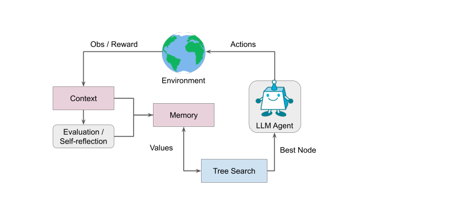
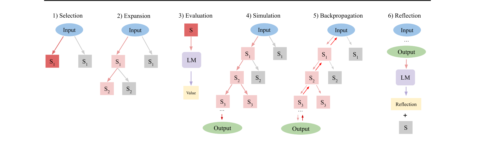
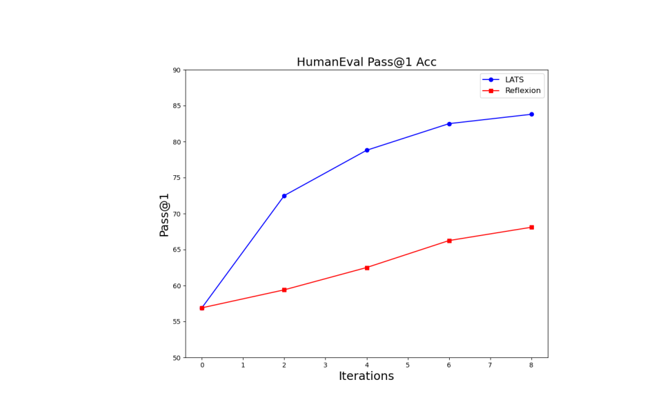
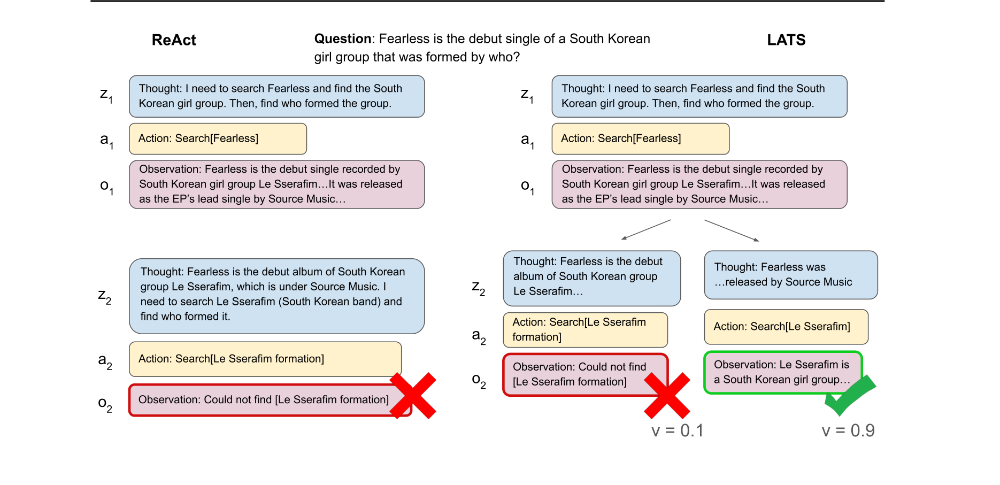

# 语言智能体树搜索：统一语言模型中的推理、行动与规划

> 原文：Proceedings of the 41st International Conference on Machine Learning, Vienna, Austria. PMLR 235, 2024. · arXiv:2310.04406v3 [cs.AI] 6 Jun 2024
> 代码：https://github.com/lapisrocks/LanguageAgentTreeSearch ｜ 图片素材存于 `lats_assets/`
> 本文件为原 Markdown 稿的全篇中文翻译：正文、表格、图注、伪代码与提示词均译为中文（提示词代码块内的英文示例一并译出）；图片保留原样，图下附中文讲解。参考文献按学术惯例保留原文。

**作者：** Andy Zhou¹²、Kai Yan¹、Michal Shlapentokh-Rothman¹、Haohan Wang¹、Yu-Xiong Wang¹

¹ 伊利诺伊大学厄巴纳-香槟分校（UIUC）。² Lapis Labs。通讯作者：Andy Zhou <andyz3@illinois.edu>。

---

## 摘要

尽管语言模型（LM）在众多决策任务上展现出了潜力，但其对简单行动过程的依赖限制了它作为自主智能体（autonomous agent）的大规模部署。本文提出**语言智能体树搜索（Language Agent Tree Search，LATS）**——首个将语言模型在推理、行动与规划三方面能力协同起来的通用框架。借助语言模型的上下文学习能力，我们把蒙特卡洛树搜索（Monte Carlo Tree Search，MCTS）整合进 LATS，使语言模型可以作为智能体工作，并配合由语言模型驱动的价值函数与自我反思，实现熟练的探索与更强的决策。我们方法的一个关键特征是引入环境以获取外部反馈，这提供了一种更审慎、更自适应的问题求解机制，突破了现有技术的局限。我们在编程、交互式问答（QA）、网页导航与数学等多个领域做了实验评估，验证了 LATS 在决策上的有效性与通用性，同时保持了有竞争力甚至更好的推理性能。值得注意的是：LATS 与 GPT-4 搭配在 HumanEval 编程基准上达到了最先进的 pass@1 准确率（92.7%）；在 WebShop 网页导航上，LATS 与 GPT-3.5 搭配取得平均分 75.9 的无梯度（gradient-free）表现，与基于梯度微调的方法相当。

---

## 1 引言

能够在多种环境中推理与决策的通用自主智能体（Wooldridge and Jennings, 1995）一直是人工智能领域的长期研究兴趣。传统上这一方向在强化学习中研究，而近期语言模型（LM）的兴起（Brown et al., 2020; Chowdhery et al., 2023; Touvron et al., 2023; OpenAI, 2023）——它们具有强推理能力与出色的通用适应性——提供了另一种范式。语言模型不仅在摘要（Nallapati et al., 2016）、语言推理（Bowman et al., 2015）等标准 NLP 任务上表现出色，也被适配到越来越多需要高级常识推理或定量能力的任务上（Cobbe et al., 2021; Saparov and He, 2023）。此外，语言模型还能在涉及知识与推理的复杂环境中运作，例如网页导航（Yao et al., 2022; Deng et al., 2023）、工具使用（Schick et al., 2023）与开放式游戏（Fan et al., 2022）。

提示技术的进步进一步提升了推理与行动能力——这些技术用外部环境的反馈或观察来增强语言模型，以 ReAct（Yao et al., 2023b）及其他工作（Gao et al., 2023; Shinn et al., 2023）为代表。这消解了完全依赖语言模型基础能力的必要性，通过外部工具或语义反馈对其进行增强。尽管有这些优点，这些方法本质上是反应式（reflexive）的，缺乏人类那种深思熟虑、审慎思考的决策特征（Sloman, 1996; Evans, 2010）。具体来说，它们不会考虑多条推理路径，也不做前瞻规划。近期的搜索引导式语言模型工作（Xie et al., 2023; Yao et al., 2023a; Hao et al., 2023）通过在多条推理链上搜索来解决这个问题。这类方法虽然实现了规划，但都是孤立运作的，没有纳入能够改进推理的外部反馈。



**图 1：** LATS 总览。作为一个统一框架，LATS 利用外部环境与基于 MCTS 的搜索算法来改进推理与决策。

**图片讲解：** 这张图给出了 LATS 的宏观图景：中心是一棵从问题出发生长出来的搜索树，语言模型智能体在树的节点处"思考 + 行动"，环境（如维基百科检索接口、网站、代码解释器）返回观察与反馈；树的选择、扩展、评估、模拟、回传、反思六个操作循环往复，直到找到正确答案。图中还以示意方式把 LATS 与此前方法做了定位对比：CoT/自我一致性只做线性推理链，ReAct 加了环境交互但仍是单条反应式轨迹，ToT/RAP 有树搜索但封闭在模型内部知识里——LATS 是把"树搜索 + 环境反馈 + 反思"三者合体的第一个框架。

为克服这些挑战，我们提出**语言智能体树搜索（LATS）**——一个用语言模型做决策与推理的统一框架。如图 1 所示，LATS 把 ReAct（Yao et al., 2023b）扩展为在"可能的推理与行动步骤"这一组合空间上的搜索，从而把语言模型的推理、行动与规划策略协同起来。这项工作并不平凡——把搜索算法适配到语言智能体、从非交互任务转向交互任务，需要在节点、提示与搜索算法上做实质性的新设计。特别是：节点与提示必须能有效地存取外部反馈，搜索算法则要把这些信息转化为用于赋值的有用启发式。事实上，我们在 HotPotQA（Yang et al., 2018）上的实证评估（见 5.1 节）表明：对已有方法做简单拼接是不够的——即便能拿到环境给出的真实答案（ground truth），简单拼接甚至无法超过纯内部推理的性能。

支撑 LATS 的**关键洞察**是：把蒙特卡洛树搜索（MCTS）适配到语言智能体上——这一方面受其在基于模型的强化学习中成功的启发（Silver et al., 2017），另一方面基于一个观察：许多语言模型任务允许回退（revert）到早前的步骤。我们把预训练语言模型重新用作智能体，配合由语言模型驱动的价值函数与自我反思，实现更聪明的探索。借助现代语言模型的通用能力与上下文学习能力，我们用语言作为各组件之间的接口，使 LATS 无需额外训练就能让规划适应环境状况。据我们所知，LATS 是首个同时纳入推理、行动与规划以提升语言模型性能的框架。值得注意的是：LATS 在 HotPotQA（Yang et al., 2018）上把 ReAct（Yao et al., 2023b）的性能翻倍，在 WebShop（Yao et al., 2022）上把平均分提高 22.1（GPT-3.5）。与 GPT-4 搭配时，LATS 在 HumanEval（Chen et al., 2021）上取得 92.7 的 Pass@1，创下最先进水平。

我们的**贡献**如下：1) 提出 LATS——一个基于蒙特卡洛树搜索的框架，从采样出的动作中构造最佳轨迹，与反应式提示方法相比能更灵活、更自适应地求解问题。2) 提出一种新的价值函数来引导搜索过程，并吸纳了自我精炼（self-refinement）与自一致性（self-consistency）等成功启发式。3) 通过整合外部反馈与自我反思，LATS 增强了模型的合理性（sensibility），使智能体能够从经验中学习，超越了基于推理的搜索方法。通过在编程、交互式问答（QA）、网页导航与数学等多个领域的实验，我们展示了 LATS 在增强自主推理与决策上的多面性。

---

## 2 相关工作

**语言模型用于推理。** 对语言模型而言，推理意味着把复杂输入分解为通往最终答案的一系列中间步骤（Cobbe et al., 2021），其代表是思维链（CoT）提示（Wei et al., 2022）及其变体（Wei et al., 2022; Kojima et al., 2022; Wang et al., 2022）。然而这些方法在单步内自回归地构造推理链，随着步骤数增加，复合误差会导致误差传播（Guo et al., 2018; Chen et al., 2023b）。各种改进旨在缓解该问题：一些方法（如自一致性，Wang et al., 2022）对采样出的推理链做多数投票；另一些聚焦多步分解，如 least-to-most 提示（Zhou et al., 2022）。近来，CoT 被搜索算法改进（Yao et al., 2023a; Hao et al., 2023; Besta et al., 2023），这些算法能更有效地采样轨迹。思维树（Tree-of-thought，ToT）提示（Yao et al., 2023a）使用 DFS 或 BFS 搜索，由语言模型生成的启发式引导；经由规划做推理（RAP，Hao et al., 2023）使用 MCTS，rollout 由语言模型模拟。但它们只依赖语言模型的内部知识，无法利用有用的外部反馈。

**语言模型用于行动。** 语言模型强大的推理与常识能力被进一步适配为交互式环境中的策略模型，用于决策或行动任务。在机器人领域，语言模型被用作控制策略的高层控制器（Ahn et al., 2022; Huang et al., 2022; Driess et al., 2023）。类似工作（Baker et al., 2022; Wang et al., 2023）也把语言模型智能体适配到 Minecraft 等复杂多模态游戏（Guss et al., 2019; Fan et al., 2022）。语言模型在基于文本的环境中特别有用（Liu et al., 2018; Shridhar et al., 2020; Liu et al., 2024），ReAct（Yao et al., 2023b）这类基于行动的提示技术在那里取得了成功。与 CoT 类似，ReAct 受限于其简单性，无法有效适应环境状况。针对这一问题提出了许多扩展，包括用自我改进增强推理与决策的 self-refine（Madaan et al., 2023）与 Reflexion（Shinn et al., 2023），以及同时纳入正负反馈的 AdaPlanner（Sun et al., 2023）。但这些方法聚焦于精炼单条轨迹，不考虑每一步的备选方案。此外，近期工作（Huang et al., 2024）指出语言模型无法自我纠正其内部推理，因此使用外部反馈至关重要。另外，在纯决策环境中，通过提供外部工具的访问权限——如 API、搜索引擎、计算器与其他模型——也增强了语言模型的推理与实践能力（Schick et al., 2023; Shen et al., 2023; Surís et al., 2023）。我们在表 1 中总结了先前工作。

**表 1：** 推理、行动与规划相关工作总结。LATS 是首个纳入全部三个领域设计的工作。（✓ = 支持）

| 方法 | 推理 | 行动 | 规划 | 自我反思 | 外部记忆 |
|---|:---:|:---:|:---:|:---:|:---:|
| CoT (Wei et al., 2022) | ✓ | × | × | × | × |
| ReAct (Yao et al., 2023b) | ✓ | ✓ | × | × | × |
| ToT (Yao et al., 2023a) | ✓ | × | ✓ | ✓ | ✓ |
| RAP (Hao et al., 2023) | ✓ | × | ✓ | × | ✓ |
| Self-Refine (Madaan et al., 2023) | ✓ | × | × | ✓ | × |
| 束搜索 (Xie et al., 2023) | ✓ | × | × | ✓ | × |
| Reflexion (Shinn et al., 2023) | ✓ | ✓ | × | ✓ | ✓ |
| **LATS（本文）** | ✓ | ✓ | ✓ | ✓ | ✓ |

**基于树的搜索。** 基于树的搜索——在搜索中探索多个结果分支——因其良好的探索-利用（exploration-exploitation）权衡，被广泛用于许多规划算法（Swiechowski et al., 2021; LaValle, 1998）与强化学习（RL）算法（Hafner et al., 2019; Du et al., 2023; Wu et al., 2023）。注意，虽然基于树的搜索需要一个能从任意状态扩展的环境模型（Vodopivec et al., 2017）——在强化学习中通常需要额外训练（Hafner et al., 2023）——但对大多数语言模型任务来说不存在这个问题，因为对许多任务而言，把输入设为上下文、把对应的前次输出设为内容，就能方便地回退到任意状态。因此我们在基于树的框架上运作，使用 MCTS（Swiechowski et al., 2021）充分释放语言模型的潜力。此外，借助语言模型的上下文学习能力（Brown et al., 2020），我们避免了在语言描述上训练价值函数的开销。同期工作（Liu et al., 2023）也探索了把搜索算法与语言模型智能体结合，但使用的是现成的搜索算法，对语言模型而言未必最优。最后，沿用 Yao et al. (2023a) 与 Hao et al. (2023) 的用法，本文把*规划（planning）*与*搜索算法（search algorithms）*互换使用。

---

## 3 预备知识

### 3.1 问题设定与提示

我们先定义问题，并概述几种利用语言模型做推理或决策的成熟方法。在语言模型推理或决策中，给定自然语言输入 $x$ 与参数为 $\theta$ 的预训练语言模型 $p_\theta(x)$，目标是生成与答案对应（推理）或完成任务（决策）的最终输出 $y \sim p_\theta(x)$。$x$ 与 $y$ 都是语言*序列*，由一系列 *token*（自然语言的基本元素，通常是词）组成，记作 $x = (x[1], \dots, x[l_x])$ 与 $y = (y[1], \dots, y[l_y])$，其中 $l_x$、$l_y$ 为长度。语言模型自回归地解码文本：即没有其他输入时，模型生成序列 $y$ 的概率为 $p_\theta(x) = \prod_{i=1}^{l_x} p_\theta(x[i] \mid x[1...i-1])$。通常为了改进推理，会随输入 $x$ 一起提供*提示（prompt）*，即特定指令或少样本"输入-输出"示例。我们把"输入 $\text{prompt}_{IO}(x)$ 经语言模型变换为输出 $y$"这一通用过程记为：$y \sim p_\theta(\text{prompt}_{IO}(x))$。

**思维链（CoT）提示**（Wei et al., 2022）适用于从 $x$ 到 $y$ 的直接映射很复杂的场景，例如 $x$ 是数学查询或难题。它的关键是构造*思考（thought）* $z_1, \dots, z_l$，作为 $x$ 与 $y$ 之间的垫脚石；每个思考 $z_i$ 都是一个语言序列。采用 CoT 提示时，思考被依次抽取：$z_i \sim p_\theta^{CoT}(x, z_{1\dots i-1})$，最终输出为 $y \sim p_\theta^{CoT}(x, z_{1\dots l})$。

**思维树（ToT）提示**（Yao et al., 2023a）通过在思考上探索多条推理路径来扩展 CoT 提示。它把问题框定为树上的搜索，每个节点 $s = [x, z_{1\cdot i}]$ 表示一个部分解状态，包含原始输入 $x$ 与思考序列 $z_{1\dots i}$。思考 $z_i$ 通过 CoT 提议或采样生成：$z_i \sim p_\theta^{CoT}(x, z_{1\dots i-1})$。深度优先（DFS）或广度优先（BFS）等搜索算法被用于系统地探索该树，并由基于语言模型对各状态评估 $V(s)$ 的启发式引导。

**ReAct**（Yao et al., 2023b）把语言模型扩展到这样的任务：从 $x$ 到 $y$ 的映射需要外部环境的交互（或被其增强），例如游戏或 API。该技术构造动作空间 $\hat{A} = A \cup Z$，在 CoT 的推理痕迹 $z \in Z$ 之外加入了允许的动作 $a \in A$。来自环境的观察 $o$ 被用于改进推理与行动。用 ReAct 解题时，每次观察之后，动作依次从 $p_\theta$ 生成：$a_i \sim p_\theta^{ReAct}(x, o_{1\dots i-1}, a_{1\dots i-1})$，最终输出为 $y \sim p_\theta^{ReAct}(x, o_{1\dots l}, a_{1\dots l})$。本文与 ReAct、Reflexion（Shinn et al., 2023）等其他语言模型智能体方法一致，聚焦于迭代间可以回退的决策任务。

上述提示技术虽然提升了语言模型在推理任务上的表现，但在涉及多面决策的困难任务上会失灵，原因有几点：1) **灵活性**：基础提示设计（CoT 或 ReAct）从语言模型自回归采样，忽略了特定状态处潜在的替代延续。2) **合理性**：基于推理的方法（CoT、RAP（Hao et al., 2023）或 ToT）只依赖语言模型的内部表示，无法考虑外部观察。这种依赖带来事实幻觉与误差传播的风险，并设置了性能天花板。3) **适应性**：当前的规划策略（RAP 或 ToT）要么使用 BFS 这类简单搜索算法，要么无法利用环境反馈来改进规划。此外智能体是静态的，无法复用先前经验或从试错中学习。RAP 虽然也采用 MCTS，但受限于"语言模型能充当世界模型并准确预测状态"的任务。这些短板限制了语言模型作为通用问题求解智能体的部署能力，正是 LATS 的动机所在。

### 3.2 蒙特卡洛树搜索（MCTS）

蒙特卡洛树搜索（MCTS）是一种启发式搜索算法，已在许多决策环境中被证明成功，例如 Atari（Ye et al., 2021）与围棋（Silver et al., 2016）。MCTS 构造一棵决策树，树中每个节点是一个状态，每条边是一个动作。MCTS 运行 $k$ 个回合（episode）；每个回合从根节点（即初始状态）出发，迭代执行两个步骤来扩展树：1) **扩展（Expansion）**：从当前父状态 $p$ 采样 $n$ 个动作，探索出多个子状态 $s$；2) **选择（Selection）**：选取 **UCT**（应用于树的置信上界，Upper Confidence bounds applied to Trees，Kocsis and Szepesvári, 2006）值最高的子节点供下一轮迭代扩展。子状态 $s$ 的 UCT 计算如下：

$$
\mathrm{UCT}(s) = V(s) + w\,\sqrt{\frac{\ln N(p)}{N(s)}}, \tag{1}
$$

其中 $N(s)$ 是节点的访问次数，$V(s)$ 是 $s$ 子树的价值函数（期望回报），$w$ 是探索权重，$p$ 是 $s$ 的父节点。当一个回合走到终点时，执行一次**回传（backpropagation）**：用回报 $r$ 沿路径更新每个 $V(s)$，公式为 $V(s) = \frac{V_{old}(s)(N(s)-1) + r}{N(s)}$，其中 $V_{old}(s)$ 是旧的价值函数。通常 MCTS 的主要缺点是需要一个环境模型来撤销先前步骤、构造搜索树，这可能是一个很强的假设。然而对许多语言模型任务来说这一限制*并不存在*：只需复制粘贴历史的文本输入，我们就能方便地重置到任意步骤。这一特殊性质正是本工作的关键动机。

---

## 4 统一推理、行动与规划

### 4.1 语言模型智能体

根据基础提示框架的设计，LATS 支持序贯的推理或决策任务。在时间步 $t$，智能体从环境接收观察 $o_t \in O$，并按某个策略 $\pi(a_t \mid x, o_{1\dots t-1}, a_{1\dots t-1})$ 采取行动 $a_t \in A$。我们用 $p_\theta$ 初始化智能体，把语言模型有用的语言表示用作基础决策器。我们沿用 ReAct 的具体化方式：动作空间 $\hat{A} = A \cup Z$ 同时包含允许动作的空间 $A$ 与推理痕迹的语言空间 $Z$。动作直接影响环境并产生观察；思考则用于整理信息、规划未来动作或注入内部知识，从而把决策形式化。动作空间的确切具体化取决于具体环境——对决策任务，动作可能是网站上的命令；对推理任务，动作空间可能限于少数外部工具或 API。在没有反馈的环境（如纯推理任务）中，我们以 CoT 作为基础提示框架。

我们不贪心地解码一条轨迹或解法，而是以当前状态为条件从 $p_\theta$ 采样 $n$ 个动作。其直觉是：对复杂决策任务，很可能存在一系列正确的潜在轨迹或推理路径（Evans, 2010）。在每一步采样一组多样的候选，既缓解了语言模型文本生成的随机性，又使得在决策空间与推理空间中都能做更充分的探索。我们把 $p_\theta$ 包进我们提出的搜索算法里，从采样出的动作中审慎地构造最佳轨迹。

### 4.2 LATS

LATS 的主要组件是一个用规划来控制问题求解过程的搜索算法。为找到最有希望的轨迹并系统性地平衡探索与利用，我们采用 MCTS 的一个变体，把决策框定为树搜索：每个节点 $s = [x, a_{1\cdot i}, o_{1\cdot i}]$ 表示一个状态，包含原始输入 $x$、动作序列 $a_{1\cdot i}$ 与观察序列 $o_{1\cdot i}$，其中 $i$ 是文本序列中的 token。

我们的主要技术贡献是*把 MCTS 适配到语言智能体上*。LATS 把 $p_\theta$ 重新用作智能体、状态评估器与反馈生成器，借助现代语言模型有用的语言表示来促进规划。标准 MCTS 与 RAP（Hao et al., 2023）依赖内部动力学模型来做模拟，而 LATS 使用环境交互，不需要世界模型。如图 2 所示，LATS 由一系列依次执行的操作组成——*选择、扩展、评估、模拟、回传与反思*——直到任务成功完成，或在采样 $k$ 条轨迹后达到计算上限。LATS 的完整伪代码见附录 A 节。



**图 2：** LATS 六种操作总览。一个节点被*选择*、*扩展*、*评估*，然后*模拟*直到抵达终止节点，随后把得到的价值*回传*。若轨迹失败，则生成一段*反思*，作为后续试次的额外上下文。这些操作依次执行，直到预算用尽或任务成功。

**图片讲解：** 图中把一个 MCTS 迭代周期拆成六格漫画：①选择——从根出发按 UCT 公式挑出一条通往叶子的路径；②扩展——在选中的节点处采样 n 个动作，环境对每个动作返回观察，树长出 n 个新节点；③评估——用"LM 打分 + 自一致性"组成的价值函数给新节点赋值；④模拟——沿着高价值节点一路向下走，直到到达终止状态（答对/答错）；⑤回传——把终局的回报沿路径逐节点更新价值与访问计数；⑥反思——如果这条轨迹失败了，让 LM 阅读失败轨迹写一段总结教训的文字，存进记忆供下次尝试参考。整个循环反复执行，预算内找到成功轨迹即停。

**选择。** 第一步操作是找出当前树中最适合后续扩展的一段。从根节点（记为初始状态 $s_0$）出发，在树的每一层选择一个子节点，直到抵达叶节点。为平衡探索与利用，我们使用式 (1) 所示的 UCT 算法。

**扩展。** 选好节点后，第二步操作通过从 $p_\theta$ 采样 $n$ 个动作来扩展树（如前节所述）。环境接收每个动作并以观察的形式返回相应反馈，于是树上新增 $n$ 个子节点。这棵树存放在一个外部长期记忆结构中。

**评估。** 第三步操作为每个新子节点赋一个标量价值，供选择与回传使用。这个价值有效地量化了智能体在任务完成上的进展，作为启发式把搜索引向树中最有希望的区域。由于 LATS 不涉及训练，我们为这一场景提出一种基于两个组件的新价值函数：(1) 自我生成的 **LM 打分**；(2) **自一致性**得分。受 ToT 启发，我们通过提示 $p_\theta$ 对给定状态进行推理，把它重新用作价值函数。为得到标量价值，我们指示 $p_\theta$ 在推理痕迹末尾给出一个分数，表明该轨迹的正确性。我们与 ToT 的关键区别是：这个价值是在获得环境反馈之后取得的，从而改进了价值赋值。这也使方法能扩展到更具挑战性的环境——没有外部反馈时，语言模型很难改进自己的回答（Huang et al., 2024）。此外，为进一步改进价值赋值，我们引入一个基于自一致性（Wang et al., 2022）的额外启发式：在同一状态被多次采样到的动作往往更准确。由此得到整体价值函数：

$$
V(s) = \lambda * \mathrm{LM}(s) + (1 - \lambda) * \mathrm{SC}(s), \tag{2}
$$

其中 $\lambda$ 是超参数。值得注意的是，我们的方法比编程式启发式（Campbell et al., 2002）更灵活，比学习式启发式（Silver et al., 2017）更高效。

**模拟。** 第四步操作把当前选中的节点继续扩展，直到抵达终止状态。在每个深度层级，我们用相同的操作采样并评估节点，但优先考虑价值最高的节点。抵达终止状态为轨迹的正确性提供了客观反馈。若任务成功完成，LATS 终止搜索。若解法部分成功或不成功，则执行下述两个额外操作。轨迹是否成功由具体环境的设计决定，例如在网页导航环境中以完成购买为准。

**回传。** 该操作根据轨迹的结果更新树中的价值。对从搜索树根（初始状态 $s_0$）到叶（终止状态 $s_l$）的轨迹中的每个节点 $s_0, s_1, \dots, s_l$，按模拟结果更新其价值：$N(s_i) = N(s_{i-1}) + 1$，$V(s_i) = \frac{V(s_{i-1}) N(s_{i-1}) + r}{N(s_i)}$，其中 $r$ 是奖励。这些更新后的价值被用于 UCT 公式（式 (1)），指导下一个节点的选择。

**反思。** 除环境反馈外，我们还利用*自我反思*进一步精炼决策过程（Shinn et al., 2023; Madaan et al., 2023）。当遇到不成功的终止节点时，我们把轨迹与最终回报一起提示给 $p_\theta$，让它给出一段文字形式的自我反思：总结推理或行动过程中的错误，并提出更好的替代方案。我们把失败轨迹与对应的反思都存入记忆。在后续迭代中，它们作为额外上下文注入智能体与价值函数，通过上下文学习精炼二者。这提供了一种比标量价值更有用的语义梯度信号，使智能体能从试错中学习，而无需付出强化学习这类昂贵优化的代价。

**讨论。** 从概念上讲，LATS 作为语言模型智能体推理与决策的通用框架，有几个值得注意的优点。(1) **通用性**：通过定义思考与动作的共享空间，LATS 同时支持推理与决策任务。(2) **审慎性**：LATS 中 MCTS 与 LM 价值函数的结合保证了有原则的搜索——在选择高价值选项的同时探索有希望的替代方案。(3) **适应性**：通过观察与自我反思纳入外部反馈，使 LATS 在问题求解中具备更强的适应能力。(4) **灵活性**：通过修改状态设计与树的维度，LATS 可以适配不同场景、环境与资源约束。(5) **模块化**：基础 LM 智能体、反思生成器与价值函数可以独立替换，并针对各自的语言模型特性做适配。

---

## 5 实验

为展示 LATS 的普遍适用性，我们在多个需要推理与行动的领域评估该方法：编程（Chen et al., 2021; Austin et al., 2022）、HotPotQA（Yang et al., 2018）、WebShop（Yao et al., 2022）与 Game of 24（Yao et al., 2023a）。

### 5.1 HotPotQA

对一个既可以用基于推理的策略、也可以用基于行动的策略处理的任务，我们考虑 HotPotQA（Yang et al., 2018）——一个多跳问答基准，要求对两个或更多维基百科段落做检索。对动作空间，除 LM 思考外，我们沿用 Yao et al. (2023b) 的设置：为智能体提供搜索与检索信息的 API 调用。这些 API 调用的输出与自我生成的反思构成观察空间。注意，与先前工作（Yao et al., 2023b; Shinn et al., 2023）一致，我们对 HotPotQA 使用 oracle 设定：环境在收到答案时反馈答案是否正确。这使我们能在反馈质量高的场景中公平比较本方法与基线，从而聚焦评估智能体利用外部反馈的能力。我们使用 100 个问题的子集，每种方法各用 3 个少样本示例。对 ToT，我们使用 DFS 作为基础搜索算法。对所有涉及采样的方法（包括 LATS），采样 $k = 50$ 条轨迹。更多细节见附录 D 节。

我们通过从上下文中移除动作与观察来评估内部推理策略，对应于 CoT（Wei et al., 2022）及其变体 CoT-SC（Wang et al., 2022）、ToT（Yao et al., 2023a）与 RAP（Hao et al., 2023）。这些方法完全依靠智能体已有知识回答问题。我们进一步考虑基于行动的方法 ReAct、Reflexion 与 LATS——它们用交互式 API 环境增强智能体，主要评估其信息检索能力。我们还设计了一种把搜索算法与 LM 智能体简单整合的方式：把 ToT 与 RAP 扩展上 ReAct 提示以处理外部观察。此外，虽然 LATS 面向的是外部反馈能增强推理的场景，我们也实现了一个仅推理版本，以 CoT 作为基础提示框架。更进一步，我们把内部与外部推理结合进 LATS：先用基于 CoT 的提示，失败后再切换到基于 ReAct 的提示。这更接近人类处理该任务的方式：只有当答案不在已知范围内时，才使用工具检索额外信息。

**结果。** 从表 2 与表 3 可见，内部推理与外部检索策略在 HotPotQA 上都表现良好。得益于大规模训练语料，现代语言模型已经编码了事实知识，往往能直接答对。CoT 能略微提升需要推理的问题的表现，而搜索方法 ToT 与 RAP 的收益更大（表 2 第 4、5 行），因为它们能采样并探索更多输出。基于行动的方法上我们观察到类似结果：即便采样相同数量的轨迹，LATS 通过有原则的搜索扩展更多节点，也超过了 ReAct——这一点在改变每次迭代扩展的节点数 $n$ 时得到印证：增大 $n$ 能持续提升性能，尽管计算与推理开销更大。LATS 在内部推理上也超过 RAP，但在 HotPotQA 的决策设定下表现优于推理设定。与 LATS 相反，ToT 与 RAP 的 ReAct 版本（表 3 第 4、5 行）甚至比 HotPotQA 的仅推理设定更差，这说明基于行动的设定更具挑战性，把搜索算法适配到决策场景绝非易事。在 LATS 中结合内部与外部推理取得了最高性能，表明即便在基础 LM 已经能胜任的任务上，外部反馈对增强推理也很重要。

**表 2：** GPT-3.5 在 HotpotQA 上基于推理的提示结果。LATS 取得最高的精确匹配（EM）。扩展时采样 $n=5$ 个节点、共 $k=50$ 条轨迹。

| 提示方法 | HotpotQA (EM)↑ |
|---|---|
| 基础 LM | 0.32 |
| CoT (Wei et al., 2022) | 0.34 |
| CoT-SC (Wang et al., 2022) | 0.38 |
| ToT (Yao et al., 2023a) | 0.55 |
| RAP (Hao et al., 2023) | 0.60 |
| RAP (n=10) | 0.60 |
| **LATS (CoT)** | **0.62** |

**表 3：** GPT-3.5 在 HotpotQA 上基于行动的提示结果。LATS 取得最高的 EM。采样 $n=5$ 个节点、$k=50$ 条轨迹。

| 提示方法 | HotpotQA (EM)↑ |
|---|---|
| ReAct (Yao et al., 2023b) | 0.32 |
| ReAct（k 中选优） | 0.38 |
| Reflexion (Shinn et al., 2023) | 0.51 |
| ToT (ReAct) | 0.39 |
| RAP (ReAct) | 0.54 |
| **LATS (ReAct)** | **0.63** |
| LATS (n=3) | 0.58 |
| LATS (n=10) | 0.65 |
| LATS (CoT + ReAct) | 0.71 |

### 5.2 编程

为展示外部观察对复杂推理任务的重要性，我们在 HumanEval（Chen et al., 2021）¹ 与 MBPP（Austin et al., 2022）上评估基线与 LATS。两个数据集都衡量从自然语言文档字符串（docstring）合成 Python 程序的正确性。我们以单个解法作为动作空间，以测试套件与编译器反馈作为外部观察。我们沿用 Chen et al. (2023a)，用 LM 为每个问题生成一套语法有效的 "assert" 语句构成的合成测试套件。每一步，解法在这套测试上评估，结果（包括通过与失败的测试及编译器输出）作为观察加入上下文。

对该任务，推理与行动基线共享动作空间，但行动方法能把观察作为额外上下文纳入。对 LATS，由于每个动作对应一个完整解法，我们跳过 LATS 的模拟步骤，直接把测试通过率用作回传的奖励。我们使用 $k=8$ 次迭代，生成 4 个测试，扩展时采样 $n=5$ 个解法。搜索完成后，选取价值最高的解法，在真实测试套件上评估 pass@1 准确率。更多细节见附录 D 节。

**结果。** 表 4 与表 5 表明，搜索与语义反馈对更好性能都至关重要。尽管没有使用观察，ToT 与 RAP 仍能与 Reflexion 相竞争。LATS 在两个数据集上性能最高。RAP 使用与 LATS 类似的搜索算法，这揭示了外部反馈对编程这类困难推理任务的重要性。与 GPT-4 搭配时，LATS 创下 HumanEval 的最先进水平，验证了 LATS 可以与更强的 LM 搭配取得更高性能。

> ¹ 一些基线使用 HumanEval 的 161 个问题。我们对 LATS 使用全部 164 个问题，发现性能差异很小，因此两种设定的基线都予以报告。

**表 4：** GPT-3.5 与 GPT-4 在 HumanEval 上的 Pass@1 准确率。使用 LATS 提示取得最佳性能。扩展时采样 5 个解法、共 8 次迭代。

| 提示方法 | 模型 | Pass@1↑ |
|---|---|---|
| CoT (Wei et al., 2022) | GPT-3.5 | 46.9 |
| ReAct (Yao et al., 2023b) | GPT-3.5 | 56.9 |
| Reflexion (Shinn et al., 2023) | GPT-3.5 | 68.1 |
| ToT (Yao et al., 2023a) | GPT-3.5 | 54.4 |
| RAP (Hao et al., 2023) | GPT-3.5 | 63.1 |
| **LATS (ReAct)** | GPT-3.5 | **83.8** |
| 基础 LM | GPT-4 | 80.1 |
| Reflexion | GPT-4 | 91.0 |
| **LATS (ReAct)** | GPT-4 | **92.7** |

**表 5：** GPT-3.5 在 MBPP 上的 Pass@1 准确率。扩展时采样 5 个解法、共 8 次迭代。

| 提示方法 | Pass@1↑ |
|---|---|
| CoT (Wei et al., 2022) | 54.9 |
| ReAct (Wei et al., 2022) | 67.0 |
| Reflexion (Shinn et al., 2023) | 70.0 |
| ToT (Yao et al., 2023a) | 65.8 |
| RAP (Hao et al., 2023) | 71.4 |
| **LATS (ReAct)** | **81.1** |

### 5.3 WebShop

对一个有实际应用的复杂决策环境，我们考虑 WebShop（Yao et al., 2022）——一个在线购物环境，由包含 118 万件真实商品与 1.2 万条人类指令的网站构成。智能体必须通过各种命令在网站导航，购买符合用户规格的商品。我们使用预构造的搜索与点击命令动作空间，以浏览器反馈与反思作为观察。性能用两个指标衡量：平均**得分（score）**，反映所选商品满足用户指定属性的百分比；**成功率（SR）**，表示所选商品满足全部给定条件的频率。我们与基于行动的提示方法及基于 RL 的方法比较。我们在 50 条指令上评估，LATS 扩展 $n=5$ 个子节点，并为 LATS、ReAct（k 中选优）与 Reflexion 设定 $k=30$。更多细节与提示词见附录 D 节与 G 节。

**结果。** 从表 6 可见，GPT-3.5 + ReAct 与模仿学习（IL）有竞争力，且配合更强的提示策略可以超过强化学习技术。用 ReAct 与 Reflexion 采样 $k=30$ 条轨迹得到相近的性能，说明在 WebShop 这样的复杂环境中语义反馈帮助有限。与 Shinn et al. (2023) 的发现类似，我们注意到生成的反思往往笼统、不能提供有用反馈，导致智能体倾向困在局部极小值。然而使用 LATS 确实带来显著提升，表明在相同迭代次数下它能做更有效的探索。

**表 6：** WebShop 上的得分与成功率（SR）。结果按提示方法、基于 RL 的训练与人类表现分组。在相同迭代次数下，LATS 同时提升得分与 SR，并超过基于 RL 的训练。

| 方法 | 得分↑ | SR↑ |
|---|---|---|
| ReAct (Yao et al., 2023b) | 53.8 | 28.0 |
| ReAct（k 中选优） | 59.1 | 32.0 |
| Reflexion (Shinn et al., 2023) | 64.2 | 35.0 |
| **LATS (ReAct)** | **75.9** | **38.0** |
| IL (Yao et al., 2022) | 59.9 | 29.1 |
| IL+RL (Yao et al., 2022) | 62.4 | 28.7 |
| 微调 (Furuta et al., 2024) | 67.5 | 45.0 |
| 专家 | 82.1 | 59.6 |

### 5.4 消融研究与补充分析

我们进一步在 Game of 24 上测试 LATS 的推理能力，并在 HotPotQA 上做额外实验以展示 LATS 各组件的作用（结果见表 8）。HotPotQA 上关于 token 消耗的更多消融见附录 C 节的表 9。

**Game of 24 上的推理。** 为展示 LATS 如何应用于纯内部推理任务，我们额外在 Game of 24（Yao et al., 2023a）上评估——这是一个数学推理任务，智能体必须用一组数字与基本运算构造出 24。我们使用 CoT 作为基础提示设计，并采用与其他设定相同的操作。从表 7 可见，LATS 超过了先前专门为推理提出的方法。这归功于我们提出的价值函数——它把自一致性作为额外启发式纳入。

**表 7：** GPT-3.5 在 Game of 24 上的结果。采样 $n=5$ 个节点、$k=30$ 条轨迹。

| 提示方法 | Game of 24（成功率）↑ |
|---|---|
| CoT (Wei et al., 2022) | 0.08 |
| Reflexion (Shinn et al., 2023) | 0.12 |
| ToT (Yao et al., 2023a) | 0.20 |
| RAP (Hao et al., 2023) | 0.40 |
| **LATS (CoT)** | **0.44** |

**自我反思。** LATS 使用自我反思为智能体提供额外的语义信号。在表 8（第 5、6 行）中，我们观察到移除自我反思后性能下降 0.05，验证了其有用性。这个收益小于表 3 中 Reflexion 相对 ReAct 的 0.19 收益，说明"能被自我反思改进的问题"与"能被搜索改进的问题"存在重叠。该变体仍优于 RAP (ReAct)，反映了我们对 MCTS 的改进。

**搜索算法。** MCTS 比 A*（Zhuang et al., 2023）或 DFS 这类变体是更有原则的搜索算法，也是所观察到性能增益的基础。我们考察了使用 DFS 的效果，并纳入 ToT 所用的基于 LM 的启发式（剪掉低价值分支）。这移除了选择与回传操作；在表 8（第 4 行）中，采样相同节点数时性能下降 0.21，但仍优于 ToT (ReAct)。尽管同样受益于真实答案反馈，LATS 比 ToT 与 RAP 用得更好，因此能超过这些方法。我们还在表 8（第 3 行）发现：LM 打分——我们价值函数的主要组件——对利用外部反馈与取得强性能至关重要。

**表 8：** HotPotQA 上 LATS 与基线变体的消融结果。使用 ReAct 作为基础提示，采样 $n=5$ 个子节点与 $k=50$ 条轨迹。LATS 需要每一个组件与操作才能达到最优性能。

| 提示方法 | HotPotQA (EM)↑ |
|---|---|
| ToT (ReAct) | 0.39 |
| RAP (ReAct) | 0.54 |
| LATS（去掉 LM 启发式） | 0.37 |
| LATS (DFS) | 0.42 |
| LATS（去掉反思） | 0.58 |
| **LATS (ReAct)** | **0.63** |



**图 3：** GPT-3.5 在 HumanEval 上随迭代次数变化的性能。

**图片讲解：** 图中横轴是迭代（试次）次数，纵轴是 HumanEval 的 Pass@1，两条曲线分别是 LATS 与 Reflexion。两者都随迭代增加而上升，但 LATS 上升得更快、更持久：Reflexion 在少数几次迭代后就趋于平台（反思内容越来越笼统，难以带来新增益），而 LATS 依靠树搜索持续探索新的解法分支，增益衰减更慢。这说明在允许重复尝试的编程场景中，LATS 的计算预算利用率更高。

**样本复杂度与 token 消耗。** LATS 的一个潜在顾虑是：树结构搜索可能比已有方法消耗多得多的 token。为进一步研究 LATS 相对先前方法的计算开销，我们考察了本文所有方法的样本复杂度（即渐近 token 开销），并统计了在 HotPotQA 上成功搜索时，本方法与其他树结构方法（ToT 与 RAP）平均扩展的节点数。结果见表 9 与表 10：本方法与其他树搜索方法具有相同的样本复杂度，且成功时所需的总 token 与状态数更少。若把失败轨迹也计入，token 开销差距更大——因为本方法成功率更高、更少触及计算预算上限。采样更少轨迹时同样如此：平均而言，LATS 比 RAP 少 3.55 个节点、比 ToT 少 12.12 个节点。这些发现凸显了我们对 MCTS 的改进及其对语言模型智能体的适配，带来了更有原则、更高效的搜索机制。

**表 9：** 采用树搜索的方法的性能、样本复杂度、平均扩展节点数与成功时的 token 消耗。$n$ 是每步扩展的子节点数，$k$ 是轨迹数。LATS 与其他树搜索方法的样本复杂度相同，且成功时扩展更少节点，意味着更低的 token 开销。

| 方法 | 性能↑ | 样本复杂度↓ | Token 消耗↓ |
|---|---|---|---|
| ReAct（k=250 中选优） | 0.42 | O(k) | - |
| CoT-SC (n=1, k=250) | 0.40 | O(k) | - |
| LATS (n=1, k=50) | 0.48 | O(k) | - |
| ToT (ReAct, n=5, k=50) | 0.49 | O(kn) | 210,215 |
| RAP (ReAct, n=5, k=50) | 0.54 | O(kn) | 176,500 |
| **LATS (n=5, k=50)** | **0.63** | O(kn) | **173,290** |

**表 10：** HotPotQA 上不同方法的开销比较。在采样不同 $k$ 条轨迹时，LATS 都取得最高准确率，且成功所需的平均节点数/状态数最少。

| 方法 | k | HotPotQA↑ | 节点数↓ |
|---|---|---|---|
| ToT | 10 | 0.34 | 33.97 |
| RAP | 10 | 0.44 | 31.53 |
| LATS | 10 | 0.44 | 28.42 |
| ToT | 30 | 0.39 | 47.54 |
| RAP | 30 | 0.50 | 37.71 |
| LATS | 30 | 0.52 | 34.12 |
| ToT | 50 | 0.49 | 84.05 |
| RAP | 50 | 0.54 | 70.60 |
| **LATS** | 50 | **0.61** | **66.65** |

---

## 6 结论

本工作提出了**语言智能体树搜索（LATS）**——首个统一推理、行动与规划以增强语言模型问题求解能力的框架。LATS 通过用搜索算法审慎地构造轨迹、纳入外部反馈、使智能体从经验中学习，弥补了先前提示技术的关键局限。我们的评估表明：LATS 能够在多种决策任务上发挥语言模型的能力，同时不经过额外训练就保持其推理能力。搜索、交互与反思之间的协同提供了一种多面的自主决策方法，凸显了语言模型作为通才智能体的潜力。

**局限与未来方向。** LATS 有两个主要局限，应用前需要考虑。其一，与 ReAct 或 Reflexion 这类更简单的提示方法相比，它的计算开销更高，这在某些场景下可能限制其实用性。其二，LATS 假设决策环境允许回退到先前状态，这并非在所有可能的环境中普遍成立。尽管有这些局限，值得注意的是：LATS 相比同类方法仍取得更好的性能与效率，且每步扩展的节点数提供了性能与效率之间的权衡旋钮。此外，我们预计推理期计算成本会随时间下降，从而提升 LATS 与其他"系统 2"式语言模型方法的实用性。最后，回退性质在许多现实应用中可行，为语言模型决策社区打开了新的机会。未来方向包括把 LATS 扩展到更复杂的环境或多智能体框架，以及改进效率以降低成本。关于 LATS 局限的更详细讨论见附录 B 节。

### 影响声明

LATS 是一个通过与环境交互提升语言模型性能的框架。这种自主决策能力的提升可能助长语言模型的有害用途。另一方面，LATS 增强了解释性与更大程度对齐的潜力：它涉及多轮决策与反思中的高层语言推理与行动，而非依赖自回归生成。最后，增强语言模型智能体的能力可能带来安全风险，例如执行恶意软件。我们鼓励进一步研究以充分理解并缓解语言模型的风险。

### 致谢

我们感谢 Daniel Campos 对本文早期版本的有益反馈。本工作部分由 NSF 资助 2106825、NIFA 奖励 2020-67021-32799、通过伊利诺伊健康护理工程系统中心与 OSF 基金会的 Jump ARCHES 捐赠，以及 IBM-伊利诺伊发现加速器研究所支持。本工作通过 ACCESS 计划的分配 CIS220014、CIS230012 与 CIS230218 使用了 NCSA Delta 上的 NVIDIA GPU。

## 参考文献

（参考文献保留英文原文，便于检索与引用。）

- Michael Ahn, Anthony Brohan, Noah Brown, et al. Do as I can, not as I say: Grounding language in robotic affordances. In *CoRL*, 2022.
- Jacob Austin, Augustus Odena, Maxwell Nye, Maarten Bosma, Henryk Michalewski, David Dohan, Ellen Jiang, Carrie Cai, Michael Terry, Quoc Le, and Charles Sutton. Program synthesis with large language models. In *NeurIPS*, 2022.
- Bowen Baker, Ilge Akkaya, Peter Zhokhov, Joost Huizinga, Jie Tang, Adrien Ecoffet, Brandon Houghton, Raul Sampedro, and Jeff Clune. Video pretraining (VPT): Learning to act by watching unlabeled online videos. In *NeurIPS*, 2022.
- Maciej Besta, Nils Blach, Ales Kubicek, et al. Graph of thoughts: Solving elaborate problems with large language models. *arXiv:2308.09687*, 2023.
- Samuel R Bowman, Gabor Angeli, Christopher Potts, and Christopher D Manning. A large annotated corpus for learning natural language inference. In *EMNLP*, 2015.
- Tom B. Brown, Benjamin Mann, Nick Ryder, et al. Language models are few-shot learners. In *NeurIPS*, 2020.
- Murray Campbell, A Joseph Hoane Jr, and Feng-hsiung Hsu. Deep blue. *Artificial intelligence*, 2002.
- Bei Chen, Fengji Zhang, Anh Nguyen, Daoguang Zan, Zeqi Lin, Jian-Guang Lou, and Weizhu Chen. CodeT: Code generation with generated tests. In *ICLR*, 2023a.
- Mark Chen, Jerry Tworek, Heewoo Jun, et al. Evaluating large language models trained on code. *arXiv:2107.03374*, 2021.
- Wenhu Chen, Xueguang Ma, Xinyi Wang, and William W. Cohen. Program of thoughts prompting: disentangling computation from reasoning for numerical reasoning tasks. *TMLR*, 2023b.
- Aakanksha Chowdhery, Sharan Narang, Jacob Devlin, et al. PaLM: Scaling language modeling with pathways. *JMLR*, 24(240):1–113, 2023.
- Karl Cobbe, Vineet Kosaraju, Mohammad Bavarian, et al. Training verifiers to solve math word problems. *arXiv:2110.14168*, 2021.
- Xiang Deng, Yu Gu, Boyuan Zheng, Shijie Chen, Samuel Stevens, Boshi Wang, Huan Sun, and Yu Su. Mind2web: Towards a generalist agent for the web. In *NeurIPS Datasets and Benchmarks Track*, 2023.
- Danny Driess, Fei Xia, Mehdi S. M. Sajjadi, et al. PaLM-E: An embodied multimodal language model. In *ICML*, 2023.
- Yilun Du, Mengjiao Yang, Bo Dai, Hanjun Dai, Ofir Nachum, Joshua B. Tenenbaum, Dale Schuurmans, and Pieter Abbeel. Learning universal policies via text-guided video generation. In *NeurIPS*, 2023.
- Jonathan St BT Evans. Intuition and reasoning: A dual-process perspective. *Psychological Inquiry*, pages 313–326, 2010.
- Linxi Fan, Guanzhi Wang, Yunfan Jiang, et al. MineDojo: Building open-ended embodied agents with internet-scale knowledge. In *NeurIPS Datasets and Benchmarks Track*, 2022.
- Hiroki Furuta, Ofir Nachum, Kuang-Huei Lee, Yutaka Matsuo, Shixiang Shane Gu, and Izzeddin Gur. Multimodal web navigation with instruction-finetuned foundation models. In *ICLR*, 2024.
- Luyu Gao, Aman Madaan, Shuyan Zhou, et al. PAL: Program-aided language models. In *ICML*, 2023.
- Jiaxian Guo, Sidi Lu, Han Cai, Weinan Zhang, Yong Yu, and Jun Wang. Long text generation via adversarial training with leaked information. In *AAAI*, 2018.
- William H. Guss, Brandon Houghton, Nicholay Topin, Phillip Wang, Cayden Codel, Manuela Veloso, and Ruslan Salakhutdinov. MineRL: A large-scale dataset of Minecraft demonstrations. In *IJCAI*, 2019.
- Danijar Hafner, Timothy Lillicrap, Ian Fischer, Ruben Villegas, David Ha, Honglak Lee, and James Davidson. Learning latent dynamics for planning from pixels. In *ICML*, 2019.
- Danijar Hafner, Jurgis Pasukonis, Jimmy Ba, and Timothy Lillicrap. Mastering diverse domains through world models. *arXiv:2301.04104*, 2023.
- Shibo Hao, Yi Gu, Haodi Ma, et al. Reasoning with language model is planning with world model. In *EMNLP*, 2023.
- Jie Huang, Xinyun Chen, Swaroop Mishra, Huaixiu Steven Zheng, Adams Wei Yu, Xinying Song, and Denny Zhou. Large language models cannot self-correct reasoning yet. In *ICLR*, 2024.
- Wenlong Huang, F. Xia, Ted Xiao, et al. Inner monologue: Embodied reasoning through planning with language models. In *CoRL*, 2022.
- Levente Kocsis and Csaba Szepesvári. Bandit based monte-carlo planning. In *ECML*, 2006.
- Takeshi Kojima, Shixiang Shane Gu, Machel Reid, Yutaka Matsuo, and Yusuke Iwasawa. Large language models are zero-shot reasoners. In *NeurIPS*, 2022.
- Steven M. LaValle. Rapidly-exploring random trees: A new tool for path planning. *The Annual Research Report*, 1998.
- Evan Zheran Liu, Kelvin Guu, Panupong Pasupat, Tianlin Shi, and Percy Liang. Reinforcement learning on web interfaces using workflow-guided exploration. In *ICLR*, 2018.
- Xiao Liu, Hao Yu, Hanchen Zhang, et al. AgentBench: Evaluating LLMs as agents. In *ICLR*, 2024.
- Zhihan Liu, Hao Hu, Shenao Zhang, Hongyi Guo, Shuqi Ke, Boyi Liu, and Zhaoran Wang. Reason for future, act for now: A principled framework for autonomous LLM agents with provable sample efficiency. *arXiv:2309.17382*, 2023.
- Aman Madaan, Niket Tandon, Prakhar Gupta, et al. Self-refine: Iterative refinement with self-feedback. In *NeurIPS*, 2023.
- Ramesh Nallapati, Bowen Zhou, Cicero dos Santos, Caglar Gulcehre, and Bing Xiang. Abstractive text summarization using sequence-to-sequence RNNs and beyond. In *SIGDAT*, 2016.
- OpenAI. GPT-4 technical report. *arXiv:2303.08774*, 2023.
- Yujia Qin, Shihao Liang, Yining Ye, et al. ToolLLM: Facilitating large language models to master 16000+ real-world APIs. In *ICLR*, 2024.
- Abulhair Saparov and He He. Language models are greedy reasoners: A systematic formal analysis of chain-of-thought. In *ICLR*, 2023.
- Timo Schick, Jane Dwivedi-Yu, Roberto Dessì, et al. Toolformer: Language models can teach themselves to use tools. In *NeurIPS*, 2023.
- Yongliang Shen, Kaitao Song, Xu Tan, Dongsheng Li, Weiming Lu, and Yueting Zhuang. HuggingGPT: Solving AI tasks with ChatGPT and its friends in Hugging Face. In *NeurIPS*, 2023.
- Noah Shinn, Federico Cassano, Beck Labash, Ashwin Gopinath, Karthik Narasimhan, and Shunyu Yao. Reflexion: Language agents with verbal reinforcement learning. In *NeurIPS*, 2023.
- Mohit Shridhar, Xingdi Yuan, Marc-Alexandre Côté, Yonatan Bisk, Adam Trischler, and Matthew Hausknecht. ALFWorld: Aligning text and embodied environments for interactive learning. In *ICLR*, 2020.
- David Silver, Aja Huang, Chris J. Maddison, et al. Mastering the game of Go with deep neural networks and tree search. *Nature*, 529:484–489, 2016.
- David Silver, Aja Huang, Chris J. Maddison, et al. Mastering chess and Shogi by self-play with a general reinforcement learning algorithm. *arXiv:1712.01815*, 2017.
- Steven A. Sloman. The empirical case for two systems of reasoning. *Psychological Bulletin*, 119:3–22, 1996.
- Haotian Sun, Yuchen Zhuang, Lingkai Kong, Bo Dai, and Chao Zhang. AdaPlanner: Adaptive planning from feedback with language models. In *NeurIPS*, 2023.
- Dídac Surís, Sachit Menon, and Carl Vondrick. ViperGPT: Visual inference via Python execution for reasoning. In *ICCV*, 2023.
- Maciej Swiechowski, Konrad Godlewski, Bartosz Sawicki, and Jacek Ma'ndziuk. Monte Carlo tree search: A review of recent modifications and applications. *Artificial Intelligence Review*, 56:2497–2562, 2021.
- Hugo Touvron, Louis Martin, Kevin Stone, et al. Llama 2: Open foundation and fine-tuned chat models. *arXiv:2307.09288*, 2023.
- Tom Vodopivec, Spyridon Samothrakis, and Branko Ster. On Monte Carlo tree search and reinforcement learning. *JAIR*, 60:881–936, 2017.
- Guanzhi Wang, Yuqi Xie, Yunfan Jiang, et al. Voyager: An open-ended embodied agent with large language models. *arXiv:2305.16291*, 2023.
- Xuezhi Wang, Jason Wei, Dale Schuurmans, Quoc Le, Ed Chi, and Denny Zhou. Self-consistency improves chain of thought reasoning in language models. In *ICLR*, 2022.
- Jason Wei, Xuezhi Wang, Dale Schuurmans, Maarten Bosma, Ed Chi, Quoc Le, and Denny Zhou. Chain of thought prompting elicits reasoning in large language models. In *NeurIPS*, 2022.
- Michael Wooldridge and Nicholas R Jennings. Intelligent agents: Theory and practice. *The Knowledge Engineering Review*, 10:115–152, 1995.
- Philipp Wu, Alejandro Escontrela, Danijar Hafner, Pieter Abbeel, and Ken Goldberg. Daydreamer: World models for physical robot learning. In *CoRL*, 2023.
- Yuxi Xie, Kenji Kawaguchi, Yiran Zhao, Xu Zhao, Min-Yen Kan, Junxian He, and Qizhe Xie. Decomposition enhances reasoning via self-evaluation guided decoding. *arXiv:2305.00633*, 2023.
- Zhilin Yang, Peng Qi, Saizheng Zhang, Yoshua Bengio, William W Cohen, Ruslan Salakhutdinov, and Christopher D. Manning. HotpotQA: A dataset for diverse, explainable multi-hop question answering. In *EMNLP*, 2018.
- Shunyu Yao, Howard Chen, John Yang, and Karthik R Narasimhan. WebShop: Towards scalable real-world web interaction with grounded language agents. In *NeurIPS*, 2022.
- Shunyu Yao, Dian Yu, Jeffrey Zhao, et al. Tree of thoughts: deliberate problem solving with large language models. In *NeurIPS*, 2023a.
- Shunyu Yao, Jeffrey Zhao, Dian Yu, Nan Du, Izhak Shafran, Karthik Narasimhan, and Yuan Cao. ReAct: Synergizing reasoning and acting in language models. In *ICLR*, 2023b.
- Weirui Ye, Shaohuai Liu, Thanard Kurutach, Pieter Abbeel, and Yang Gao. Mastering Atari games with limited data. In *NeurIPS*, 2021.
- Denny Zhou, Nathanael Schärli, Le Hou, et al. Least-to-most prompting enables complex reasoning in large language models. In *ICLR*, 2022.
- Yuchen Zhuang, Xiang Chen, Tong Yu, et al. ToolChain*: Efficient action space navigation in large language models with A* search. In *ICLR*, 2023.

---

# LATS 附录

附录组织如下：A 节给出我们所提算法 LATS 的伪代码；B 节进一步讨论方法的局限；C 节给出额外实验结果；D 节说明实验中的环境细节；最后，E 节（HotPotQA）、F 节（编程）、G 节（WebShop）分别列出三个环境所用的提示词。

## A. LATS 伪代码

算法 1 给出 LATS 的伪代码。节点显式存放在记忆中。除非另有说明，所有实验中我们设采样节点数 $n=5$、探索权重 $w=1$。HotPotQA 与 Game of 24 使用自一致性权重 $\lambda=0.5$，编程与 WebShop 使用 $\lambda=0.8$。

**算法 1** LATS($s$, $p_\theta$, $p_V$, $p_{ref}$, $d$, $k$, $n$, $w$, $a$, $b$)

```text
输入：初始状态 s、动作生成器 p_θ、价值函数 p_V、反思生成器 p_ref、
     生成动作数 n、深度上限 L、推演次数 K、上下文 c、
     探索权重 w、价值函数权重 λ
初始化动作空间 A、观察空间 O
初始化状态-动作价值函数 p_V: S×A → R，访问计数器 N: S → N 初始化为 1
for k ← 0,...,K−1 do
    for t ← 0,...,L−1 do
        if s_t 不是终止状态 then                    ▷ 扩展与模拟
            for i ← 1,...,n do
                采样 a_t^(i) ~ p_θ(s_t)
                从环境获得 o_t^(i)，s_{t+1}^(i) ← (c_t^(i), o_t^(i), a_t^(i))，
                c_{t+1}^(i) ← (o_t^(i), a_t^(i))
                评估 V_t^(i) ~ λ * p_V(s_{t+1}^(i)) + (1−λ) * SC(s_{t+1}^(i))   ▷ 评估
                V(s_t) ← V_t^(i)
                把 s_{t+1}^(i) 加入子节点集合
            end for
        end if
        if s_t 是终止状态 then                     ▷ 反思
            从环境获得 r
            if r 不成功 then
                reflection ← p_ref(c_t)
                c ← reflection
            end if
        end if
        a_t ← arg max_{a∈e(s_t)} [ V(s_t) + w * sqrt(ln N(s_t) / N(s_{t+1})) ]   ▷ 选择
        从记忆中取出对应的 o_t，s_{t+1} ← (c_t, o_t, a_t)，c_{t+1} ← (o_t, a_t)
        N(s_{t+1}) ← N(s_{t+1}) + 1
        if a_t 是输出动作 then break
    end for
    T ← 实际步数
    for t ← T−1,...,0 do                             ▷ 回传
        V(s_t) ← V(s_t) * (N(s_t) − 1) + r / N(s_t)
    end for
end for
```

## B. 关于局限的更多讨论

如第 6 节所述，LATS 有两个主要局限：

**计算开销。** 尽管 LATS 能改进推理与决策，但相对 ReAct 或 Reflexion 这类更简单的提示方法，它的计算开销更高。不过以下事实可作为缓解：

- 渐近地看，本方法与 ToT（Yao et al., 2023a）和 RAP（Hao et al., 2023）具有相同的样本复杂度，但性能更好、成功时扩展更少节点、平均使用更少 token。这说明我们的方法不仅解题能力更强，效率也更高。完整的开销分析见附录 C 的表 9。
- 每步扩展的节点数 $n$ 提供了性能与效率之间的天然权衡。事实上，设 $n=1$ 时本方法与多次尝试的 ReAct（Yao et al., 2023b）或 CoT-SC（Wang et al., 2022）一样高效。

总体而言，我们建议把 LATS 用于编程这类困难任务，或实践中性能优先于效率的场景。我们希望语言模型的持续进步能降低成本、扩大 LATS 的适用范围。

此外还存在查询环境的少量开销，我们发现对我们研究的环境而言可以忽略不计。大多数基于 LM 的环境涉及基于 API 的工具，使用便宜且快速。还值得注意的是：这比先前搜索方法（Hao et al., 2023; Liu et al., 2023）中把 LM 用作世界模型所伴随的推理开销更便宜。

**决策中环境可回退的假设。** 由于我们的方法基于蒙特卡洛树搜索且无模型（model-free），LATS 在决策任务上的一个局限是要求智能体能够回退到环境中的早前状态。然而这一回退性质在许多真实环境与应用中是可行的（尽管并非在所有可能环境中普遍成立），包括编程（HumanEval，Chen et al., 2021）、网页搜索（WebShop，Yao et al., 2022）、基于文本的操作任务（Alfworld，Shridhar et al., 2020）以及带工具使用的语言模型（ToolBench，Qin et al., 2024）。因此我们认为，利用回退性质不是短板，而是语言模型决策社区尚未明确注意到的一个特性——它为新兴的语言模型智能体社区打开了新的机会。

## C. 额外消融

本节对 LATS 的各种设计做消融。实验在 HotPotQA 上进行（最多 $k=50$ 条轨迹、采样大小 $n=5$）以及 HumanEval 上进行（最多 $k=8$ 条轨迹、采样大小 $n=5$）。HotPotQA 的结果见表 8，HumanEval 的结果见图 3。

**探索权重。** 我们发现，当选择公式中的探索权重 $w$ 降到 0.5 时，HotPotQA 上的性能更低，说明这降低了搜索的有效性。把 $w$ 增到 2.0 不会提升性能，但我们倾向于观察到更快的收敛。最优设定取决于具体环境与状态空间的复杂度。

**深度。** 在主实验中，我们沿用先前工作（Yao et al., 2023b），对 HotPotQA 上的所有方法使用最大深度 $d=7$。我们消融了把它降到 $d=4$ 对 LATS 的影响，结果性能只有轻微下降。我们发现大多数问题在四步内就能回答，使用更多步骤反而容易把智能体逼入局部极小值，很少能提升成功率。

**LM 价值函数。** LM 价值函数基于期望未来回报为状态打分。没有这个启发式，引导搜索的唯一信号就是已完成轨迹的环境奖励——这类信号稀少且往往是二值的。当我们移除评估操作时，观察到性能大幅下滑 0.26。

**表 11：** HotPotQA 上以精确匹配（EM）衡量的 LATS 与基线变体消融结果。我们测试了不同深度 $d$、探索因子 $w$，以及使用 CoT、去掉 LM 价值函数的 LATS 版本。采样 $n=5$、$k=50$ 条轨迹。

| 方法 | HotpotQA (EM)↑ |
|---|---|
| LATS (w=0.5) | 0.55 |
| LATS (w=2.0) | 0.63 |
| LATS (d=4) | 0.58 |
| LATS (CoT) | 0.62 |
| LATS（去掉 LM 启发式） | 0.37 |
| LATS (w=1.0, d=7) | 0.63 |

**性能随时间变化。** 为观察增加采样轨迹数的效果，我们把 $k$ 改为不同取值。我们在 HumanEval 上做该实验——由于采样轨迹较少，差异更明显。结果见图 3（见正文 5.4 节插图）：与 Reflexion 相比，LATS 随迭代次数增加的扩展性更好。

## D. 环境细节

### D.1 HotPotQA

HotPotQA（Yang et al., 2018）是一个问答数据集，需要对多个支持文档做推理来回答问题。它包含 11.3 万条基于维基百科的问答对，由众包工人构造，具有多样性、多跳性与可解释性。问题覆盖实体、地点、日期以及两个实体共有属性比较等多种类型。众包工人还提供文档中支撑答案的事实。我们使用带全部维基百科段落的 HotPotQA 基准设定来测试检索。实验使用随机选取的 100 个问题的子集，最大深度上限为 6。图 4 展示了 ReAct 与 LATS 在 HotPotQA 示例任务上的工作方式，并给出了 LATS 如何在该任务上胜过 ReAct 的定性示例。对价值函数超参数，LM 打分与自一致性打分使用 $\lambda=0.5$。



**图 4：** HotPotQA 上 ReAct（左）与 LATS（右）的示例轨迹。LATS 能采样更多动作，并通过用 LM 评估状态来引导搜索走向树中有希望的区域，从而避免重蹈先前错误的覆辙。

**图片讲解：** 左侧是 ReAct 的单条轨迹：思考→搜索→观察一路线性推进，中途某一步搜错了实体/关键词后便顺着错误信息得出了错误答案，且没有回头机制。右侧是 LATS 的树状展开：同一状态处采样了多个动作分支，LM 价值函数给各分支打分，失败分支的低分使搜索转向其他分支；配合之前失败轨迹沉淀下来的反思，智能体绕开了此前踩过的坑，最终沿高价值分支找到正确答案。这张图直观说明了"评估 + 回退 + 反思"三件事合起来为什么强过一条直线走到底。

**动作空间。** 我们采用 Yao et al. (2023b) 提出的维基百科网页 API，包含三类支持交互式信息检索的动作：

1. `search[实体]`：若该实体的维基页面存在，返回其前 5 句；否则从维基百科搜索引擎建议最相似的 5 个实体，
2. `lookup[字符串]`：返回当前页面中包含该字符串的下一句，
3. `finish[答案]`：以给定答案结束当前任务。

这些 API 调用与自由形式的思考共同构成该环境的动作空间。

### D.2 编程

HumanEval 数据集（Chen et al., 2021）包含 164 道人工编写的编程题，用于评估模型从自然语言描述合成程序的功能正确性。每道题包含函数签名、文档字符串描述、参考实现与多个单元测试，平均每题 7.7 个测试。编程任务考察自然语言理解、推理、算法与基础数学，难度与简单的软件面试题相当。通过率用 pass@k 指标评估：每题生成 k 个样本，只要有一个样本通过全部测试即视为解出。实验使用全部 164 道题，最大深度上限为 8。对三道没有示例测试用例的题，我们自己编写。价值函数超参数上，LM 打分与自一致性打分使用 $\lambda=0.8$。GPT-3.5 使用 6 个内部测试，GPT-4 使用 4 个内部测试。

Mostly Basic Programming Problems（MBPP，Austin et al., 2022）基准包含 974 个短 Python 函数，用于评估程序合成技术。数据集由具备基础 Python 知识的工人众包构造。每条数据包含编程任务的自然语言描述、参考解法实现与 3 个功能正确性测试用例。自然语言提示通常是简短的一句话描述。解法覆盖常见编程结构，包括数学运算、列表处理、字符串操作与 Python 标准库的使用，平均长度为 6.8 行代码。数据集还补充了 426 道经过人工核验的题目，保证规格无歧义、函数签名标准、测试用例准确。实验使用随机选取的 397 道题的子集。价值函数超参数上，LM 打分与自一致性打分使用 $\lambda=0.8$。

### D.3 WebShop

WebShop（Yao et al., 2022）是一个交互式网页环境，用于评估智能体的落地语言理解与决策能力。它模拟电商购物任务：提供从亚马逊抓取的超过 100 万件真实商品，横跨 5 个大类、113 个子类。这些商品包含丰富的语言信息，平均文本长度 262 词，词汇量 22.4 万。此外还有超过 80 万个可供定制的独立商品选项。环境以两种模式渲染网页：HTML 模式提供带交互元素的像素级观察；简单模式把原始 HTML 转换为结构化文本观察，更适合训练智能体。动作空间由查询搜索与按钮点击构成，在 4 种页面类型间切换：搜索页、结果页、商品页与商品详情页。指令是众包的自然语言，指定商品属性与选项，共收集 1.2 万条。自动奖励通过把智能体购买的商品与指令中指定的属性和选项比较得出，同时使用词汇匹配与语义相似度指标。

WebShop 使用两个评估指标：(1) **任务得分（Task Score）**，定义为 (100 × 平均奖励)，捕捉各回合获得的平均奖励；(2) **成功率（SR）**，定义为 $r=1$ 的指令占比。奖励基于所选商品满足的属性数量计算。实验使用 50 个环境，最大深度上限为 15。价值函数超参数上，LM 打分与自一致性打分使用 $\lambda=0.8$。

**表 12：** WebShop 的动作空间。

| 类型 | 参数 | 状态 → 下一状态 |
|---|---|---|
| search（搜索） | [查询词] | 搜索页 → 结果页 |
| choose（选择） | 返回搜索 | 搜索页 → 搜索页 |
| choose（选择） | 上一页/下一页 | 结果页 → 结果页 |
| choose（选择） | [商品标题] | 结果页 → 商品页 |
| choose（选择） | [选项] | 商品页 → 商品页 |
| choose（选择） | 描述/概览 | 商品页 → 商品详情页 |
| choose（选择） | 返回 | 商品详情页 → 商品页 |
| choose（选择） | 购买 | 商品页 → 回合结束 |

### D.4 Game of 24

Game of 24 是一个数学推理挑战：目标是用基本算术运算从 4 个数字构造出 24。我们沿用 Yao et al. (2023a) 的设置：智能体产生一个等于 24 且每个输入数字只用一次的正确算式即算成功。我们在 50 局上报告成功率。使用 $k=30$ 次迭代，最大深度上限为 5。价值函数超参数上，LM 打分与自一致性打分使用 $\lambda=0.5$。表 13 展示了 $\lambda=0.5$ 与 $\lambda=1$ 的性能比较，验证了自一致性项的设计。

**表 13：** GPT-3.5 在 Game of 24 上对 $\lambda$ 的消融。正文使用的 $\lambda=0.5$ 优于 $\lambda=1$（后者等价于移除自一致性）。

| 提示方法 | Game of 24（成功率）↑ |
|---|---|
| LATS (CoT, λ=1) | 0.40 |
| LATS (CoT) | 0.44 |

---

## E. HotPotQA 提示词

### E.1 基础行动提示

```text
用交错的"思考、动作、观察"步骤完成一个问答任务。
思考可以对当前情况进行推理，动作有三种类型：
(1) Search[实体]：在维基百科上精确搜索该实体，若存在则返回第一段；
    若不存在，则返回若干相似实体供搜索。
(2) Lookup[关键词]：返回当前段落中包含该关键词的下一句。
(3) Finish[答案]：返回答案并结束任务。
每次观察之后，给出下一个思考与下一个动作。

下面是一些示例：

问题：Arthur's Magazine 与 First for Women 哪本杂志创刊更早？
思考 1：我需要搜索 Arthur's Magazine 和 First for Women，找出哪本创刊更早。
动作 1：Search[Arthur's Magazine]
观察 1：Arthur's Magazine 是 19 世纪在费城出版的一份美国文学期刊。
由 Timothy Shay Arthur 编辑，刊登过 Edgar A. Poe、J.H. Ingraham、Sarah Josepha Hale、Thomas G.
Spear 等人的作品。[1][2] 1846 年 5 月并入 Godey's Lady's Book。[3]
思考 2：Arthur's Magazine 创刊于 1844 年。接下来我需要搜索 First for Women。
动作 2：Search[First for Women]
观察 2：First for Women 是美国 Bauer Media Group 出版的女性杂志。[1]
该杂志创刊于 1989 年，总部在新泽西州 Englewood Cliffs。[2] 2011 年该杂志
发行量为 1,310,696 册。[3]
思考 3：First for Women 创刊于 1989 年。1844（Arthur's Magazine）< 1989（First for Women），
所以 Arthur's Magazine 创刊更早。
动作 3：Finish[Arthur's Magazine]

（示例）

你此前曾尝试回答下面的问题但失败了。以下的反思给出了避免以同样方式再次失败的计划。
请用它们改进你正确回答给定问题的策略。

（轨迹）

（输入）
```

### E.2 基础推理提示

```text
通过先给出一个思考、再用 Finish 给出答案来完成问答任务。思考可以对当前情况进行推理。
Finish[答案] 返回答案并结束任务。你会得到一段上下文，应该用它来帮助回答问题。
你的回复以一个动作或带编号的思考开头。

下面是一些示例：

问题：科罗拉多造山带东段所延伸到的地区，其海拔范围是多少？让我们一步步思考。
思考 1：科罗拉多造山带的东段延伸至高平原（High Plains）。
思考 2：高平原的海拔从约 1,800 英尺升至 7,000 英尺。
思考 3：答案是 1,800 到 7,000 英尺。
动作：Finish[1,800 到 7,000 英尺]

（示例）

先前试次：（轨迹）
（输入）
```

### E.3 价值函数提示

```text
分析一个问答任务的解法轨迹。轨迹由以下内容标注：关于当前情况的"观察"、
可以对当前情况进行推理的"思考"，以及三种类型的"动作"：
(1) Search[实体]：在维基百科上精确搜索该实体，若存在则返回第一段；
    若不存在，则返回若干相似实体供搜索。
(2) Lookup[关键词]：返回当前段落中包含该关键词的下一句。
(3) Finish[答案]：返回答案并结束任务。

给定一个问题与一条轨迹，评估其正确性，并详细给出你的推理与分析。
聚焦最近的思考、动作与观察。只要到目前为止的思考与动作是正确的，
不完整的轨迹也可以是正确的，即使答案尚未找到。不要生成额外的思考或动作。
然后在最后一行总结"Thus the correctness score is s"（因此正确性得分为 s），
其中 s 是 1 到 10 的整数。

问题：Arthur's Magazine 与 First for Women 哪本杂志创刊更早？
思考 1：我需要搜索 Arthur's Magazine 和 First for Women，找出哪本创刊更早。
动作 1：Search[Arthur's Magazine]
观察 1：Arthur's Magazine 是 19 世纪在费城出版的一份美国文学期刊。
由 Timothy Shay Arthur 编辑，刊登过 Edgar A. Poe、J.H. Ingraham、Sarah Josepha Hale、Thomas G.
Spear 等人的作品。[1][2] 1846 年 5 月并入 Godey's Lady's Book。[3]

这条轨迹是正确的：搜索问题中给出的第一本杂志是合理的。而且让简单的搜索
只对应单个实体也更好，因此这是最佳动作。
因此正确性得分为 10

（其他示例）

（失败轨迹）

（上下文）
```

### E.4 反思提示

E.4 的反思提示与 E.3 价值函数提示结构一致（同样地要求分析轨迹、聚焦最近的思考/动作/观察，并以"Thus the correctness score is s"结尾），区别在于它会接在失败轨迹之后，用于给出后续试次的改进计划。

## F. 编程提示词

### F.1 HumanEval 函数实现示例

函数签名示例：

```python
def minSubArraySum(nums):
    """给定一个整数数组 nums，求 nums 的任意非空子数组的最小和。
    示例
    minSubArraySum([-1, -2, -3]) == -6
    """
```

参考实现：

```python
min_sum = float('inf')
for i in range(len(nums)):
    current_sum = 0
    for j in range(i, len(nums)):
        current_sum += nums[j]
        if current_sum < min_sum:
            min_sum = current_sum
    return min_sum
```

### F.2 基础行动/推理提示

```text
你是一个 AI Python 助手。你将得到你此前的函数实现、一系列单元测试结果，
以及你对先前实现的自我反思。请写出完整实现（重述函数签名）。

示例 1：
[先前实现]：
def add(a: int, b: int) -> int:
    """给定整数 a 和 b，返回 a 与 b 之和。"""
    return a - b

[先前实现的单元测试结果]：
通过的测试：
失败的测试：
assert add(1, 2) == 3 # 输出：-1
assert add(1, 2) == 4 # 输出：-1

[对先前实现的反思]：
该实现在输入整数为 1 和 2 的测试用例上失败了。问题出在代码没有把两个整数相加，
而是用第一个整数减去了第二个整数。为修复此问题，应把 return 语句中的运算符
从 '-' 改为 '+'。这样函数就能对给定输入返回正确输出。

[改进后的实现]：
def add(a: int, b: int) -> int:
    """给定整数 a 和 b，返回 a 与 b 之和。"""
    return a + b
```

### F.3 反思提示

```text
你是一个 Python 编程助手。你将得到一个函数实现与一系列单元测试结果。
你的目标是写几句话解释（如测试所示）你的实现为什么是错的。
这将在你稍后重试时作为指导。回答中只提供这几句话的描述，不要给出实现。
用户会给你一些示例。

示例 1：
[先前实现]：
def add(a: int, b: int) -> int:
    """给定整数 a 和 b，返回 a 与 b 之和。"""
    return a - b

[先前实现的单元测试结果]：
通过的测试：
失败的测试：
assert add(1, 2) == 3 # 输出：-1
assert add(1, 2) == 4 # 输出：-1

[对先前实现的反思]：
该实现在输入整数为 1 和 2 的测试用例上失败了。问题出在代码没有把两个整数相加，
而是用第一个整数减去了第二个整数。为修复此问题，应把 return 语句中的运算符
从 '-' 改为 '+'。这样函数就能对给定输入返回正确输出。
```

### F.4 测试用例生成提示

```text
你是一个 AI 编码助手，能够根据函数签名与文档字符串，为函数编写独特、
多样且直观的单元测试。

（输入）
```

## G. WebShop 提示词

### G.1 行动提示

```text
Webshop
指令：
我想要一瓶 3 盎司、明亮柑橘味、适合敏感肌肤的除臭剂，价格低于 50.00 美元

[搜索]
动作：search[3 ounce bright citrus deodorant sensitive skin]
观察：
[返回搜索]
第 1 页（共 50 条结果）
[下一页] [B078GWRC1J] Earth Mama 明亮柑橘除臭剂——天然、对敏感肌安全，
孕期与哺乳期可用，含有机金盏花，3 盎司 $10.99
[B078GTKVXY] Earth Mama 清新生姜除臭剂——天然、对敏感肌安全，孕期
与哺乳期可用，含有机金盏花，3 盎司 $10.99
[B08KBVJ4XN] Barrel and Oak——无铝除臭剂，男士除臭剂，精油香型，
24 小时异味防护，雪松与广藿香混合，对敏感肌温和（Mountain Sage，2.7 盎司，2 支装）
$15.95

动作：think[B078GWRC1J 和 B078GTKVXY 都是低于 50 美元的明亮柑橘味除臭剂。
我可以先看看 B078GWRC1J。]
观察：OK。
动作：click[B078GWRC1J]
观察：
[返回搜索] [上一页]
香味 [混合香型][明亮柑橘][舒缓薰衣草][清新生姜][无香]
规格 [旅行套装（4 支装）][3 盎司（单支装）][3 盎司（2 支装）]
Earth Mama 明亮柑橘除臭剂——天然、对敏感肌安全，孕期与哺乳期可用，
含有机金盏花，3 盎司
价格：$10.99 评分：无
[描述] [特性] [评价] [立即购买]

动作：think[要买 3 盎司、适合敏感肌的明亮柑橘味除臭剂，该商品有 '明亮柑橘'
和 '3 盎司（单支装）' 选项，看起来可以买了。]
观察：OK。
动作：click[明亮柑橘]
观察：你已点击"明亮柑橘"。
动作：click[3 盎司（单支装）]
观察：你已点击"3 盎司（单支装）"。
动作：click[立即购买]
```

### G.2 价值函数提示

```text
给定要购买的商品，以及一条旨在购买与规格完全匹配的商品（对应理想得分 1.0）的轨迹，
分析以下轨迹，然后在最后一行总结"Thus the correctness score is s"
（因此正确性得分为 s），其中 s 是 1 到 10 的整数。

下面是一些示例

Webshop
指令：
我在找无乳制品的苹果味薯片混合装，价格低于 30.00 美元

[搜索]
动作：search[dairy free and apple variety pack of chips]
观察：
[返回搜索]
第 1 页（共 50 条结果）
[下一页]
[B07HRFJWP8] Enjoy Life Foods 软烘焙椭圆饼干，早餐棒，无坚果棒，无大豆，无乳制品，
非转基因，无麸质，纯素，混合装，4 盒（共 20 根） $100.0
[B01KMHY5PG] Enjoy Life 软烘焙嚼劲棒，混合装，无坚果棒，无大豆，无乳制品，
无麸质，6 盒（共 30 根） $21.49
[B008D2X8C4] Enjoy Life 扁豆薯片混合装，无乳制品薯片，无大豆，无坚果，非转基因，纯素，
无麸质，24 袋（0.8 盎司） $100.0

动作：think[前两件不是我想要的。第三件才是我要的无乳制品苹果味薯片混合装。]
观察：OK。
动作：click[B008D2X8C4]
观察：
[返回搜索] [上一页]
口味名 [莳萝酸奶油][蒜香帕玛森][清淡海盐][玛格丽特披萨][泰式辣椒青柠]
[混合装] 规格 [0.8 盎司（24 袋装）][4 盎司（12 袋装）]
价格：$100.0 评分：无
[描述] [特性] [评价] [立即购买]

动作：think[该商品有 '混合装' 和 '0.8 盎司（24 袋装）' 选项，看起来可以买了。]
观察：OK。
动作：click[混合装]
观察：你已点击"混合装"。
动作：click[0.8 盎司（24 袋装）]
观察：你已点击"0.8 盎司（24 袋装）"。
动作：click[立即购买]

反思：这次尝试我失败了。我不小心买了一件 $100 的商品，超出了我 $30 的预算。
无论如何，最初的搜索结果就不好。下次我会搜索 search["variety pack of chips"]，
然后检查结果是否满足无乳制品与 $30 预算的约束。我会持续改进搜索词，
以便找到更多商品。
因此正确性得分为 5

（输入）
```

### G.3 反思提示

```text
你是一个能通过自我反思改进的高级推理智能体。你将得到一次先前的推理试次：
你被授予一个购物网站的访问权限与一种要购买的特定商品，你获得了相关上下文
与要购买的商品的访问权限。你未能买到正确的商品——要么没有找到满足全部
所需规格的商品，要么没有选中正确的商品。理想得分是 1.0，低于它即为不正确。
请用几句话诊断失败的可能原因，并设计一个新的、简洁的高层计划来避免同样的失败。
使用完整的句子。下面是一些示例：

先前试次指令：我在找无乳制品的苹果味薯片混合装，价格低于 30.00 美元 [搜索]
动作：search[dairy free and apple variety pack of chips]
观察：[返回搜索] 第 1 页（共 50 条结果） [下一页>] [B07HRFJWP8] Enjoy Life Foods 软烘焙
椭圆饼干，早餐棒，无坚果棒，无大豆，无乳制品，非转基因，无麸质，纯素，混合装，4
盒（共 20 根） $100.0 [B01KMHY5PG] Enjoy Life 软烘焙嚼劲棒，混合装，无坚果
棒，无大豆，无乳制品，无麸质，6 盒（共 30 根） $21.49 [B008D2X8C4] Enjoy Life 扁豆薯片
混合装，无乳制品薯片，无大豆，无坚果，非转基因，纯素，无麸质，24 袋（0.8 盎司） $100.0
动作：think[前两件不是我想要的。第三件才是我要的无乳制品苹果味薯片混合装。] 观察：OK。
动作：click[B008D2X8C4] 观察：[返回搜索] [<上一页] 口味名 [莳萝酸奶油][蒜香
帕玛森][清淡海盐][玛格丽特披萨][泰式辣椒青柠][混合装] 规格 [0.8 盎司（24 袋装）][4 盎司
（12 袋装）] 价格：$100.0 评分：无 [描述] [特性] [评价] [立即购买]
动作：think[该商品有 '混合装' 和 '0.8 盎司（24 袋装）' 选项，看起来可以买了。]
观察：OK。
动作：click[混合装] 观察：你已点击"混合装"。
动作：click[0.8 盎司（24 袋装）] 观察：你已点击"0.8 盎司（24 袋装）"。
动作：click[立即购买]
状态：失败

反思：这次尝试我失败了。我不小心买了一件 $100 的商品，超出了我 $30 的预算。
无论如何，最初的搜索结果就不好。下次我会搜索 search["variety pack of chips"]，
然后检查结果是否满足无乳制品与 $30 预算的约束。我会持续改进搜索词，
以便找到更多商品。

先前试次：轨迹 反思：'''
```

---

> 全篇中文翻译完成。所有图片均以 `lats_assets/figure_0N.png` 原样引用并在图下附中文讲解，表格、公式（LaTeX）、伪代码与提示词均已译为中文。
